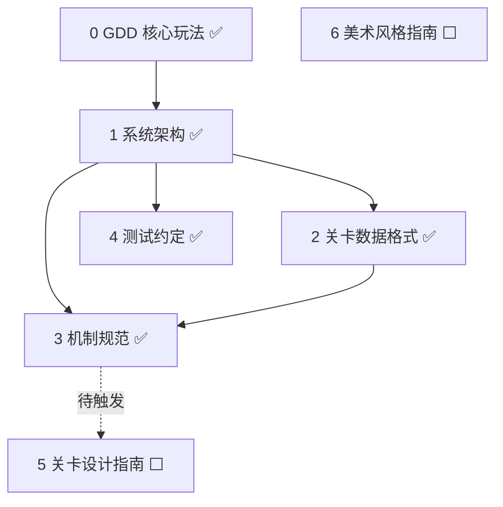

# monk 项目文档索引

> **任务来源**: 核心设计文档(roadmap Task 0~4)完成后,按 roadmap Task 7,建立 `docs/` 导航索引。
> **任务内容**: 汇总 monk 项目所有文档、依赖关系、撰写状态与建议阅读顺序。
> **参考文档**: `docs/superpowers/plans/2026-07-08-documentation-roadmap.md`(文档路线图)
> **生成日期**: 2026-07-09

`monk`(一休扫地)是 Godot 4.7 / 纯 GDScript 的休闲益智「一笔画」游戏(网格哈密顿路径)。本目录是**编码前的设计地基**。

## 核心设计文档(`docs/project/`)

| # | 文档 | 路径 | 状态 | 简介 |
|---|---|---|---|---|
| 0 | GDD 核心玩法 | `project/2026-07-08-gdd-design.md` | ✅ | 玩法规则、胜负、操作、7 类机制、关卡进度、范围 |
| 1 | 系统架构 | `project/2026-07-08-system-architecture-design.md` | ✅ | 6 模块划分、数据模型驱动、逻辑/表现分离、确定性落地 |
| 2 | 关卡数据格式 | `project/2026-07-09-level-data-format-design.md` | ✅ | `.tres` Resource 结构、TileType 矩阵 + 机制列表、章节组织 |
| 3 | 机制规范 | `project/2026-07-09-mechanics-spec-design.md` | ✅ | 各机制 can_pass / 状态公式(path 纯函数)、数据校验 |
| 4 | 测试约定 | `project/2026-07-09-testing-convention-design.md` | ✅ | 严格 TDD、GUT、目录结构、关键测试场景 |
| — | 关卡设计工具 | `project/2026-07-09-level-design-tool-design.md` | ✅ | 路径优先法关卡设计工具(WorkLevelResource + 导出) |
| — | 关卡设计指南 | `project/2026-07-09-level-design-guide-design.md` | ✅ | 关卡设计方法论(可解性 / 难度曲线 / 机制引入 / 引导) |
| — | 美术风格指南 | `project/2026-07-09-art-style-guide-design.md` | ✅ | 禅意水墨方向、配色、机制视觉、UI、资产策略 |
| — | CLAUDE.md 设计 spec | `project/2026-07-08-guidance-docs-design.md` | ✅ | 项目级 CLAUDE.md 的设计决策记录(历史) |

> 路径相对 `docs/`(即 `docs/project/...`)。

## 流程 / 计划文档(`docs/superpowers/`)

| 文档 | 路径 | 简介 |
|---|---|---|
| 文档路线图 | `superpowers/plans/2026-07-08-documentation-roadmap.md` | 文档体系总纲:核心 4 + 占位 3、依赖、撰写流程 |
| CLAUDE.md 实施计划 | `superpowers/plans/2026-07-08-claude-md.md` | CLAUDE.md 创建的实施计划(历史) |

## 项目根文档

- `CLAUDE.md`(项目根)—— AI 助手的项目级指令:技术栈、目录、架构原则、代码规范、运行构建

## 核心设计原则(贯穿全部文档)

- **状态确定性**:玩家路径 `P` 是唯一可变状态源;门 / 桥 / 机关 / 动态水等派生状态均为 `P` 的纯函数;撤销 = 截短 `P`,状态自动回滚,零副作用(GDD §4 / 架构 §9)
- **机制数据驱动**:每种机制 = 数据 Resource + 独立规则脚本;新增机制不改主循环(架构 §4.2 / 数据格式)
- **逻辑 / 表现分离**:逻辑层纯 GDScript 可独立测试,表现层节点订阅(架构 §3)
- **严格 TDD**:红绿重构,逻辑层必测(测试约定 §5/§6)

## 建议阅读顺序

1. `CLAUDE.md`(项目根)—— 项目约定
2. GDD —— 玩法(做什么)
3. 系统架构 —— 怎么做(模块、接口)
4. 关卡数据格式 + 机制规范 —— 数据形态与规则细节
5. 测试约定 —— 怎么验证

## 后续待写(占位,见 roadmap)

- **Task 5 关卡设计指南**——触发:机制规范完成 ✅ + 有首批实际关卡
- **Task 6 美术风格指南**——触发:美术方向确定(GDD §10 暂不定)
