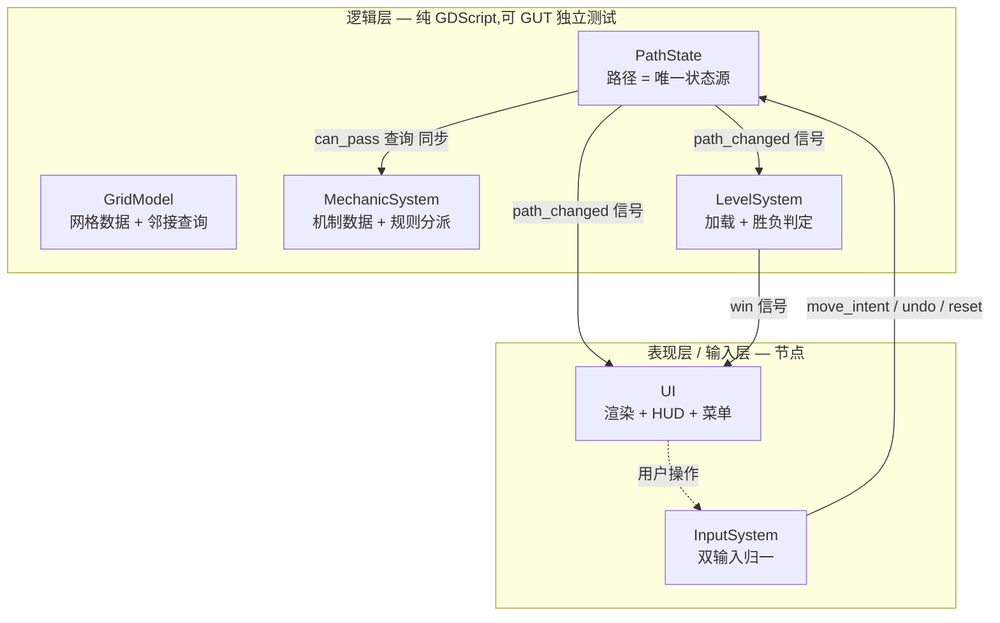
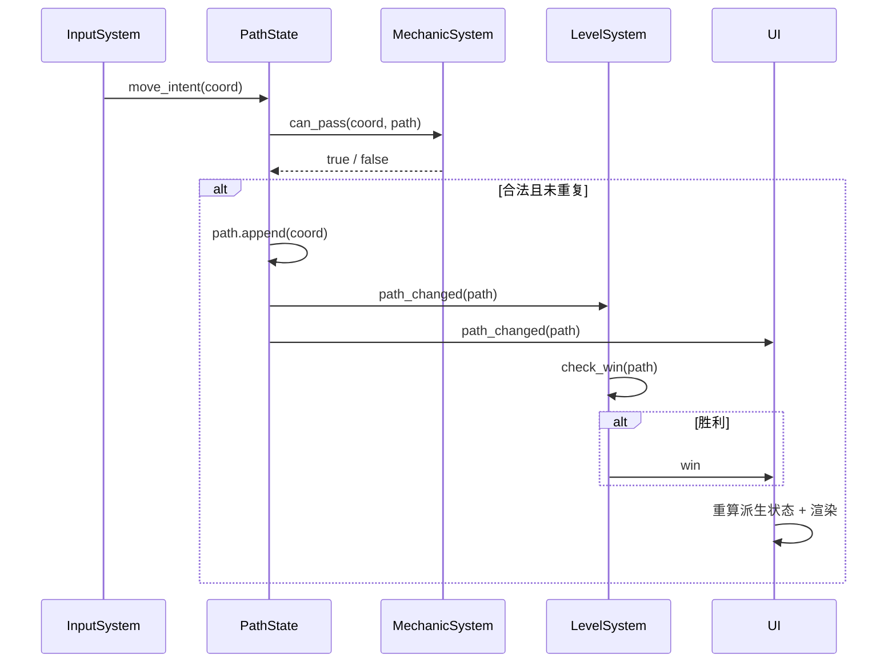

# 设计规范:monk 系统架构设计

> **任务来源**: GDD 批准后,按文档路线图(roadmap)Task 1,制定系统架构设计——把玩法落地为模块职责与接口,作为关卡数据格式 / 机制规范 / 测试约定的地基。
> **任务内容**: 定义 monk 的系统架构:6 模块划分(GridModel / MechanicSystem / PathState / LevelSystem / UI / InputSystem)、数据模型驱动 + 逻辑 / 表现分离、机制数据驱动(数据 Resource + 独立规则)、状态确定性工程落地、装配方式。
> **参考文档**:
> - `docs/project/2026-07-08-gdd-design.md` —— GDD 核心玩法(本架构的上游依据;机制清单与状态确定性原则来源)
> - `docs/superpowers/plans/2026-07-08-documentation-roadmap.md` —— 文档路线图(本任务为 Task 1)
> - `CLAUDE.md`(项目根)—— 架构原则(机制数据驱动、逻辑 / 表现分离、单一职责)、代码规范、目录约定
> **生成日期**: 2026-07-08

| 字段 | 值 |
|---|---|
| 日期 | 2026-07-08 |
| 状态 | 设计已确认,待 spec 复核 |
| 产物路径 | `docs/project/2026-07-08-system-architecture-design.md`(本文件) |
| 产出流程 | superpowers:brainstorming →(用户复核)→ 实施 |
| 上游 | GDD 核心玩法、文档路线图 Task 1 |

## 1. 背景与目标

`monk` 当前处于原型期(仅 `Scenes/boot.tscn`,无业务代码)。本架构把 GDD 定义的核心玩法落地为**模块职责划分与接口**,使 CLAUDE.md 的架构原则(机制数据驱动、逻辑 / 表现分离、单一职责)与 GDD 的状态确定性原则有明确工程方案,作为后续关卡数据格式、机制规范、测试约定文档与编码的地基。

## 2. 关键决策摘要

| # | 决策点 | 决策 |
|---|---|---|
| ① | 模块划分 | 6 模块按职责:GridModel / MechanicSystem / PathState / LevelSystem / UI / InputSystem |
| ② | 机制实现 | 机制 = 数据 Resource + 独立规则脚本;MechanicSystem 维护「类型 → 规则」映射分派 |
| — | 架构范式 | 数据模型驱动 + 逻辑 / 表现分离(逻辑层纯 GDScript 可 GUT 测试,表现层节点订阅) |
| — | 状态管理 | PathState 持路径 = 唯一可变状态源;派生状态(门 / 桥 / 水)**即时纯函数计算,不缓存** |
| — | 模块通信 | Godot Signal 事件驱动(状态变更广播)+ 查询类同步调用(通行性 / 派生状态) |
| — | 装配 | 关卡相关模块由关卡场景节点树装配(每关重建);仅进度存档 `SaveSystem` 用 autoload |

## 3. 架构总览

**分层 + 数据模型驱动**:逻辑层不依赖节点,可被 GUT 独立单元测试;表现层只读逻辑层并渲染;输入层归一双输入为统一意图。



**关键性质**:
- **唯一可变状态**:仅 `PathState.path`(玩家路径)。其余全部状态由 path 经纯函数派生。
- **逻辑 / 表现分离**:UI 不持有游戏状态,只订阅逻辑层信号渲染、转发用户意图。
- **可测试性**:逻辑层四模块无节点依赖,GUT 可直接实例化测试。

## 4. 模块详解

### 4.1 GridModel(网格模型)
- **职责**:网格数据(二维格子、尺寸)、坐标、四向邻接查询、各格机制数据引用
- **性质**:纯数据 + 查询,**无状态变化**
- **关键 API**:
```gdscript
var size: Vector2i
func cell_at(coord: Vector2i) -> Cell
func neighbors(coord: Vector2i) -> Array[Vector2i]
func mechanic_data_at(coord: Vector2i) -> MechanicData
func in_bounds(coord: Vector2i) -> bool
```

### 4.2 MechanicSystem(机制系统)〔决策②〕
- **职责**:机制数据驱动框架。持有各格机制数据 Resource;维护「机制类型 → 规则脚本」映射;以**路径 P** 为输入查询通行性与派生状态(确定性)
- **数据 / 规则分离**:
  - 机制数据 = `Resource` 子类(可 `.tres` 序列化)
  - 规则逻辑 = 独立规则脚本(纯函数,以 `(data, path)` 为入参)
  - `MechanicSystem` 用 `MechanicType` 枚举映射到对应规则实例分派
- **机制清单(GDD §7 全覆盖)**:

| 机制 | 数据 Resource | 规则脚本(纯函数) | 通行性 / 派生状态 |
|---|---|---|---|
| 假山 | `WallData` | `WallRule` | 恒不可通行 |
| 流水(静态) | `FlowingWaterData` | `FlowingWaterRule` | 恒不可通行 |
| 门 | `DoorData`(lever_ids) | `DoorRule` | 开 ⟺ path 含任一 lever;开则可通行 |
| 机关 | `LeverData`(id) | `LeverRule` | 可通行;被踩由 path 决定(供门 / 桥查询) |
| 传送门 | `PortalData`(pair_id) | `PortalRule` | 强制传送:踩入 → 出现在配对端 |
| 桥 | `BridgeData`(lever_ids) | `BridgeRule` | 铺放 ⟺ path 含任一 lever;铺放则可通行 |
| 动态水 | `DynamicWaterData`(period) | `DynamicWaterRule` | 水位 = len(path) mod period;落时可通行 |

- **关键 API**:
```gdscript
func can_pass(coord: Vector2i, path: Array[Vector2i]) -> bool
func derived_state(coord: Vector2i, path: Array[Vector2i]) -> Dictionary
func register_rule(type: MechanicType, rule: MechanicRule) -> void
```
- **开闭原则**:新增机制 = 新 `MechanicData` 子类 + 新 `MechanicRule` 子类 + 注册映射,不改 MechanicSystem 主循环

### 4.3 PathState(路径与状态管理)
- **职责**:持有玩家路径(有序格子序列)= **唯一可变状态源**;提供移动 / 撤销 / 重置;派生状态查询委托 MechanicSystem
- **即时纯函数计算**〔决策—〕:派生状态(门 / 桥 / 水等)每次查询时从 path 现算,**不缓存**。网格小(5~8 格边长)性能无忧,且完全确定性、撤销零副作用(GDD §4 工程落地)
- **关键 API**:
```gdscript
var path: Array[Vector2i]
func move(coord: Vector2i) -> bool
func undo() -> void
func reset() -> void
func is_covered(cells: Array[Vector2i]) -> bool
func derived_states() -> Dictionary

signal path_changed(path: Array[Vector2i])
```
- `move()` 内部:校验 `MechanicSystem.can_pass(coord, path)` 且 coord 未在 path 中(不重复)→ 追加并发 `path_changed`;否则返回 false

### 4.4 LevelSystem(关卡系统)
- **职责**:加载 `.tres` 关卡 → 构建 GridModel + MechanicSystem;持有当前关「需扫格集合」、起点、可选终点;**胜负判定**
- **关键 API**:
```gdscript
func load(level: LevelResource) -> void
func build() -> void
func check_win(path: Array[Vector2i]) -> bool

signal win
```
- `check_win()`:path 覆盖全部需扫格,且(若关卡定义终点)path 末端 == 终点
- **无失败判定**(可撤销设计;GDD §5)

### 4.5 UI(表现层)
- **职责**:订阅逻辑层信号渲染网格 / 玩家 / 已扫格 / 门开闭 / 桥铺放 / 水涨落;HUD(撤销 · 重置按钮);关卡选择菜单
- **不含规则逻辑**:只读逻辑层 + 转发用户意图到 InputSystem
- **节点**:`GridRenderer`、`PlayerSprite`、`HUD`、`LevelSelectMenu`

### 4.6 InputSystem(输入系统)〔GDD ②〕
- **职责**:归一双输入为统一的「移动意图」(目标格坐标)
- 桌面:方向键 / WASD → 当前格的正交相邻格为目标
- 移动:点击相邻可通行格 → 该格为目标
- **关键信号**:
```gdscript
signal move_intent(coord: Vector2i)
signal undo_request()
signal reset_request()
```

## 5. 核心数据流

### 5.1 一次合法移动


### 5.2 撤销
`InputSystem` 发 `undo_request` → `PathState.undo()` 弹出 path 末端 → 发 `path_changed` → UI 重算派生状态(门 / 桥 / 水自动回滚,因派生为 path 纯函数)。

### 5.3 胜负
仅胜利:`LevelSystem.check_win(path)` 在每次 `path_changed` 后触发;命中则发 `win`,UI 切换胜利状态。无失败路径。

## 6. 模块间接口(总览)

| 方向 | 机制 | 载体 |
|---|---|---|
| InputSystem → PathState | move_intent / undo / reset | Godot Signal |
| PathState → MechanicSystem | can_pass / derived_state 查询 | 同步方法调用 |
| PathState → LevelSystem / UI | path_changed | Godot Signal |
| LevelSystem → UI | win | Godot Signal |
| UI → InputSystem | 用户操作(点击 / 按键) | 节点输入事件 |

> 状态变更一律走 Signal(广播);纯查询(通行性、派生状态)走同步方法调用(即时返回,无副作用)。坐标统一用 `Vector2i`。

## 7. 装配方式〔决策—〕

- **关卡场景节点树装配**(每关重建):GridModel / MechanicSystem / PathState / LevelSystem / UI / InputSystem 由关卡场景(`.tscn`)实例化组装;加载新关即重建逻辑层 + 表现层
- **autoload 单例**:仅 `SaveSystem`(进度存档,跨关卡全局)。其余模块皆为节点树
- 启动:`boot.tscn` → 关卡场景(原型期单关直进;关卡选择菜单后续接入)

## 8. 目录结构映射(对应 CLAUDE.md `scripts/` 子目录)

```
scripts/
├── grid/          # GridModel、PathState(网格模型 + 路径状态)
├── mechanics/     # MechanicSystem + 各 MechanicData(数据) + 各 MechanicRule(规则)
├── level/         # LevelSystem、SaveSystem(autoload)
├── ui/            # GridRenderer / PlayerSprite / HUD / LevelSelectMenu、InputSystem
└── (按需扩展)
```

- `grid/` 容纳 GridModel 与 PathState(同属「网格层模型 + 状态」)
- `mechanics/` 内按机制拆分数据与规则文件(单一职责;机制规范文档细化)
- `InputSystem` 归 `ui/`(交互层);若后续输入复杂化可独立 `input/`
- 场景入 `scenes/`,与脚本配对(CLAUDE.md 约定)

## 9. 确定性原则工程落地(GDD §4)

| GDD 原则 | 工程落地 |
|---|---|
| 路径为唯一状态源 | 仅 `PathState.path` 可变;GridModel / MechanicSystem 无状态 |
| 派生状态 = path 纯函数 | `MechanicSystem.can_pass / derived_state` 以 path 为入参,即时计算,不缓存 |
| 撤销 = 截短 path | `PathState.undo()` 弹出末端;下次查询派生状态自动反映新 path |
| 门 / 桥 ⟺ path 含机关格 | `DoorRule / BridgeRule` 查询 path 是否含 lever |
| 动态水水位 = len(path) mod 周期 | `DynamicWaterRule` 纯函数计算 |

## 10. 验收对照(覆盖 GDD 全部机制)

- [x] GDD §7 全部 6 类机制(假山 / 流水 / 门 / 机关 / 传送 / 桥 / 动态水)在 MechanicSystem 有对应 Data + Rule(见 §4.2 表)
- [x] 每模块单一职责 + 明确接口(§4 各节 API + §6 接口表)
- [x] 状态确定性原则(GDD §4)有工程落地方案(§9)
- [x] 逻辑 / 表现分离在模块划分体现(§3 分层)

## 11. 后续 / 开放问题

- `MechanicRule` 的基类形式(Godot 无接口;用基类 + 虚方法 `_can_pass` / `_derived_state`,机制规范文档定)
- `MechanicData` 与关卡 `.tres` 的嵌套序列化细节(关卡数据格式文档定)
- 关卡场景装配的具体节点树结构(实现期结合 `scenes/` 定)
- `SaveSystem` 存档格式与进度结构(关卡数据格式文档的「章节 · 进度数据」节)
- UI 订阅逻辑层的具体刷新策略(脏标记 vs 全量重绘,实现期定)
