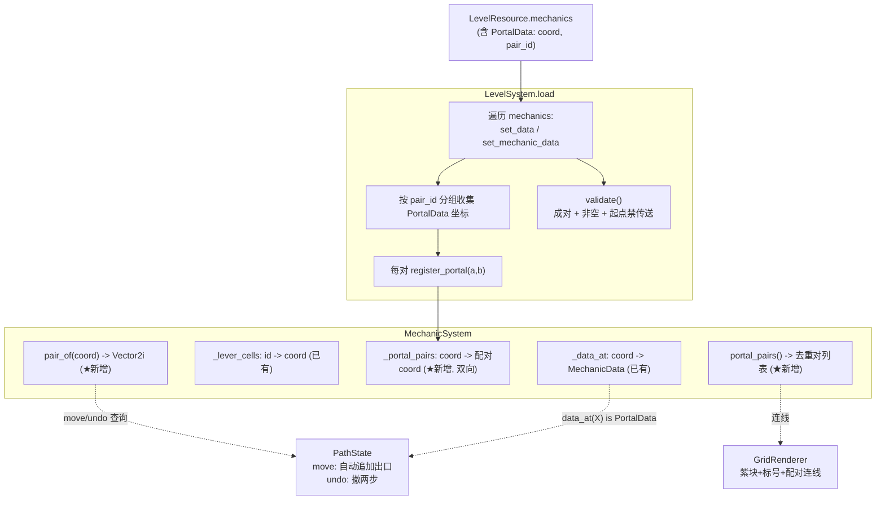

# 实现设计:monk 机制批次 2(传送 PortalData)

> **任务来源**: 机制批次 1(机关/门/桥/动态水)已 merge main(HEAD=a971b8b,38 GUT 绿)。从恢复点继续,按项目 memory「下一步」实现机制增量第二批——传送。传送是唯一需改动 `PathState.move` 的机制(批次1 刻意隔离未触碰),本批次攻克此风险点。
> **任务内容**: 在逻辑层落地机制规范中传送门(PortalData)的强制传送语义:`PathState.move` 自动追加配对端、`undo` 传送对撤两步、`pair_id` 成对校验、起点禁传送门;MechanicSystem 增配对索引与查询;LevelSystem 注入与校验;GridRenderer 配对连线+标号占位表现。顺带补 M3(桥/动态水 move 端到端集成测试)。
> **参考文档**:
> - `docs/project/2026-07-09-mechanics-spec-design.md` —— 机制规范(权威依据:§3.3 三层校验、§4.5 传送门、§6 路径构造、§7 数据校验)
> - `docs/project/2026-07-09-mechanics-batch1-design.md` —— 批次 1 设计(多态分派契约、TDD 顺序、接入点)
> - `docs/project/2026-07-09-level-data-format-design.md` —— 关卡数据格式(mechanics 列表字段)
> - `docs/project/2026-07-09-testing-convention-design.md` —— 测试约定(逻辑层必测、严格红绿重构、每绿 commit)
> - `scripts/grid/path_state.gd` `scripts/mechanics/mechanic_system.gd` `scripts/level/level_system.gd` `scripts/ui/grid_renderer.gd` —— 现状接入点
> **生成日期**: 2026-07-10

| 字段 | 值 |
|---|---|
| 日期 | 2026-07-10 |
| 状态 | 设计已确认(用户 brainstorm 5 项决策批准),待 spec 复核 → 实施 |
| 产物路径 | `docs/project/2026-07-10-portal-mechanic-design.md`(本文件) |
| 产出流程 | superpowers:brainstorming(规范张力澄清 + 5 决策)→(用户逐节批准)→ 本文档 → writing-plans |
| 上游 | 机制规范、关卡数据格式、测试约定、批次 1 设计与代码 |
| 下游 | writing-plans 逐步实现计划 |

## 1. 范围(R1:聚焦传送 + 顺手 M3)

**纳入**:
- `PortalData`(`pair_id: String`,零 override——`can_pass`/`counts_for_need_cover` 继承基类默认 `true`)
- `MechanicSystem`:`_portal_pairs` 配对索引 + `register_portal` / `pair_of` / `portal_pairs`
- `PathState`:`move` 自动追加配对端、`undo` 传送对撤两步(**批次1 唯一未触碰、本批次核心风险点**)
- `LevelSystem`:load 注入配对索引、validate 成对校验 + pair_id 非空 + 起点禁传送门
- `GridRenderer`:传送门紫色色块 + pair_id 标号 + 配对连线(P3 占位表现)
- GUT 测试覆盖(严格 TDD)+ 顺手补 M3(桥/动态水 move 端到端集成测试)

**不纳入**(留后续):技术债 M1(DynamicWater period=0 除零)/M2(流水需扫测试)/M4(is_lever_pressed 参数收紧)/M5(validate is 链);正式禅意水墨美术;关卡设计工具。

## 2. 已确认决策汇总(brainstorming 5 项)

| # | 决策点 | 选择 | 理由 |
|---|---|---|---|
| 1 | 传送执行模型 | **A 自动追加** | 玩家踏入口 X(须邻接)→ X 入 path → 系统立即追加出口 Y。path 末端永不停留「入口待出口」半态;move 三层校验零改动,仅末尾追加。对应规范 §6 |
| 2 | 撤销语义 | **A1 撤两步** | undo pop 后,若新末端传送门的配对端==刚 pop 的格,则它是入口、连带撤。零额外状态,`path` 仍是唯一状态源;传送本就是「一步意图=两格」的原子操作 |
| 3 | 起/终点边角 | **S2 禁止起点与 goal 为传送门** | 起点是「初始位置」非「踏入」;goal 是胜利判定末端,若为传送门入口则踏入后被追加配对端、末端≠goal 致永无解(审查 Major)。validate 报错拒绝两者。setup 保持单格 |
| 4 | GridRenderer 表现 | **P3 同色+标号+配对连线** | 紫色色块 + pair_id 首字符标号 + 配对两端 draw_line;连线直接表达「这两格一对」的机制本质 |
| 5 | 本批次范围 | **R1 聚焦传送 + 顺手 M3** | 外科手术式修改、边界清晰;M3 因传送改 move 共享测试基建而顺手 |

> **规范张力说明**:规范 §3.3.3「若 path[-1] 是传送门 X 则 coord 必须配对端 Y」与 §6「踏入 X 后系统自动追加 Y」字面冲突(自动追加后玩家从 Y 离开时 path[-1]=Y 也触发 §3.3.3,而 X 已在 path 会被不重复校验拦死)。本设计以 §6(自动追加)为准:传送的强制性体现为 move 末尾无条件追加出口,玩家踏入入口即被强制完成传送,无需 §3.3.3 的入口判断。

## 3. 架构与数据流



**PortalData 子类零 override**:传送的机制性全在 `PathState.move`(自动追加),PortalData 只承载配对标识 `pair_id`。`can_pass` 沿用基类默认 `true`,符合规范 §4.5「`can_pass`=true,强制约束归 PathState.move」。

## 4. 核心逻辑:PathState.move / undo(本批次最高风险)

### 4.1 move:自动追加(决策 A)

相对现状 diff——三层校验(边界/不重复/邻接/can_pass)**完全不变**,仅 append 入口后追加配对端:

```gdscript
func move(coord: Vector2i) -> bool:
    if not _gm.in_bounds(coord):
        return false
    if coord in path:
        return false
    if path.size() > 0:
        var last: Vector2i = path[path.size() - 1]
        if coord not in _gm.neighbors(last):
            return false
    if not _ms.can_pass(coord, path):
        return false
    path.append(coord)                      # 入口 X 入(玩家意图步)
    if not _append_portal_peer(coord):      # ★新增:若 X 是传送门,追加配对端 Y;异常回滚并失败
        return false
    _emit()
    return true

func _append_portal_peer(coord: Vector2i) -> bool:
    if not (_ms.data_at(coord) is PortalData):
        return true
    var peer: Vector2i = _ms.pair_of(coord)
    if peer in path:                         # 异常:不变量被破坏(孤立/自指/重复配置)
        path.pop_back()                      # 回滚刚 append 的入口 X,避免静默留「入口半态」
        return false                         # move 失败,异常显形(审查 Major M2)
    path.append(peer)                        # 出口 Y:系统强制步,不查 can_pass(Y 必为 PortalData,恒 true)
    return true
```

### 4.2 undo:撤两步(决策 A1)

**关键判据**:不是「末端是否传送门」(出口端 Y 也是 PortalData,会误伤),而是 **「末端传送门的配对端是否==刚 pop 的格」**——只有入口 X 的配对端是刚 pop 的出口 Y。每次 undo 撤「一个玩家意图」(正常格撤 1 / 传送对撤 2),故用 `if` 非 `while`:

```gdscript
func undo() -> void:
    if path.size() <= 1:
        return
    var popped: Vector2i = path[path.size() - 1]
    path.pop_back()                          # 撤出口 Y / 正常格
    var new_last: Vector2i = path[path.size() - 1]
    if _ms.data_at(new_last) is PortalData \
            and _ms.pair_of(new_last) == popped:   # 新末端是入口 X, 其配对端==刚 pop 的 Y
        path.pop_back()                      # 连带撤入口 X
    _emit()
```

**验证表**:

| path | undo 一次 → | 说明 |
|---|---|---|
| `[..., A, X, Y]` | `[..., A]` | pop Y;新末端 X 配对端=Y → pop X ✓ |
| `[..., X₁,Y₁, X₂,Y₂]` | `[..., X₁,Y₁]` | pop Y₂;新末端 X₂ 配对端=Y₂ → pop X₂;Y₁ 配对端=X₁≠Y₂,停 ✓ |
| `[..., A, B, C]`(无传送) | `[..., A, B]` | pop C;B 非 PortalData,停 → 一格一撤(回归)✓ |
| 撤到仅剩 `[start]` | `[start]` | start 非传送门(S2),停 ✓ |

**不变量**:传送对 `[X, Y]` 在 path 中恒相邻、入口在前出口在后(自动追加保证);`pair_of(new_last) == popped` 精确识别「入口待撤」;零额外状态。

## 5. 各组件落地

### 5.1 PortalData(零 override)

```gdscript
class_name PortalData
extends MechanicData

@export var pair_id: String
```

### 5.2 MechanicSystem(对称于 `_lever_cells`)

```gdscript
var _portal_pairs: Dictionary = {}  # coord -> 配对coord(双向互填)

func register_portal(a: Vector2i, b: Vector2i) -> void:
    _portal_pairs[a] = b
    _portal_pairs[b] = a

func pair_of(coord: Vector2i) -> Vector2i:
    return _portal_pairs.get(coord, coord)   # default 返回自身;已校验关卡不命中。异常(孤立/未注册)由 validate 拦截 + move 回滚(M2)双重防护,不静默

func portal_pairs() -> Array:                # 去重的 [a,b] 列表,供 renderer 画连线
    # 遍历 _portal_pairs,双向 key 去重,每对返回一次
```

### 5.3 LevelSystem:注入 + 校验

**load 顺序**(明确,审查 Minor m4):① 遍历 tiles 注入 WALL/FLOWING_WATER → ② 遍历 mechanics populate(set_data/set_mechanic_data,机关 register_lever)→ ③ 按 pair_id 收集 PortalData 坐标、成对且两端不同则 register_portal → ④ validate(level) → ⑤ setup path_state。

**③ 注入配对**(portals_by_id 局部收集;仅 size==2 且两端不同才注入,其余异常由 ④ validate 报错):

```gdscript
var portals_by_id: Dictionary = {}            # pair_id -> Array[Vector2i]
for m in level.mechanics:
    if m is PortalData:
        var arr: Array = portals_by_id.get((m as PortalData).pair_id, [])
        arr.append(m.coord)
        portals_by_id[(m as PortalData).pair_id] = arr
for id in portals_by_id:
    var coords: Array = portals_by_id[id]
    if coords.size() == 2 and coords[0] != coords[1]:
        mechanic_system.register_portal(coords[0], coords[1])
```

**④ validate**(现有 dynamic_water/door/bridge 校验之后追加;portal_coords 在此独立重建以校验两端):

```gdscript
var portal_counts: Dictionary = {}
var portal_coords: Dictionary = {}            # pair_id -> Array[Vector2i]
for m in level.mechanics:
    if m is PortalData:
        var pid := (m as PortalData).pair_id
        if pid == "":
            errors.append("PortalData.pair_id 不能为空")
        portal_counts[pid] = portal_counts.get(pid, 0) + 1
        var arr: Array = portal_coords.get(pid, [])
        arr.append(m.coord)
        portal_coords[pid] = arr
for pid in portal_counts:
    if portal_counts[pid] != 2:
        errors.append("PortalData.pair_id '%s' 须恰好成对(出现 %d 次)" % [pid, portal_counts[pid]])
    elif portal_coords[pid][0] == portal_coords[pid][1]:
        errors.append("PortalData.pair_id '%s' 两端坐标不能相同" % pid)   # 防 a,a 自指(审查 Minor m2)
if mechanic_system.data_at(level.start) is PortalData:
    errors.append("起点不能是传送门")          # 决策 S2
if level.goal != Vector2i(-1, -1) and mechanic_system.data_at(level.goal) is PortalData:
    errors.append("终点不能是传送门")          # 审查 Major M1:goal 为传送门入口则追加配对端致末端≠goal 永无解
```

### 5.4 GridRenderer(决策 P3)

```gdscript
const COLOR_PORTAL := Color(0.55, 0.35, 0.70)   # 紫
# _cell_color 增:if data is PortalData: return COLOR_PORTAL

# _draw 末尾(色块+已扫叠加之后,确保连线/标号在最上层):
for pair in _mechanic_system.portal_pairs():
    var a: Vector2i = pair[0]; var b: Vector2i = pair[1]
    var ca := Vector2((a.x + 0.5) * cell_size, (a.y + 0.5) * cell_size)
    var cb := Vector2((b.x + 0.5) * cell_size, (b.y + 0.5) * cell_size)
    draw_line(ca, cb, COLOR_PORTAL, 2.0)       # 配对连线
# 标号:Node2D 无 get_theme_default_font;var _font := ThemeDB.get_default_theme().default_font;对每个传送格 draw_string(_font, 中心坐标, pair_id 首字符)(审查 Major M4)
```

统一紫色 + pair_id 首字符标号区分不同对(占位阶段不按 pair_id 调色,标号已足够)。

## 6. TDD 顺序(严格红绿重构,每绿 commit)

| # | 步骤 | 红测试(先写) | 绿/验证 |
| 0 | 规范同步(M3) | — | 更新 mechanics-spec-design.md §3.3 第三层为「传送强制由 §6 自动追加实现,move 不做入口判断」 |
|---|---|---|---|
| 1 | PortalData + pair_of 地基 | `pair_of(配对端)` 返回对端;无配对返回自身;现有 38 回归 | 实现 PortalData/register_portal/pair_of;回归绿 |
| 2 | move 自动追加(A) | 踏入口 X 后 path=`[...,X,Y]`;非传送格 move 不追加(回归) | move 末尾加 `_append_portal_peer`;回归绿 |
| 3 | undo 撤两步(A1) | `[...A,X,Y]→[...A]`;连续传送只撤最后意图;正常格仍一格(回归) | undo 改造(`pair_of(new_last)==popped`) |
| 4 | 注入 + 校验 | 成对注入 pair_of 正确;孤立/3 次/空 pair_id 报错;配对两端相同报错;起点/goal 为传送门报错(S2) | load 注入 + validate 追加 5 类校验 |
| 5 | 顺手 M3 | 踩机关→桥铺放可走;动态水 LOW 可走/HIGH 拒绝(move 端到端) | 实现已存(批次1),补测试锁定行为 |
| 6 | 集成关卡 | `test_level_03.tres`(含传送对)加载 + 走传送路径 + 胜利覆盖 | 集成测试绿。最小布局 3×2:start(0,0)→(1,0)→传送门X(2,0)⇒Y(2,1)→(1,1)→(0,1) 覆盖全格(审查 Minor m5) |
| 7 | GridRenderer P3 | `_cell_color(PortalData)=COLOR_PORTAL` 可单测;连线/标号手动验 | 手动跑游戏可见紫块+连线+标号 |
| 8 | 全量回归 + 手动通关 | — | 全部 GUT 绿(38+新增)+ 手动跑传送可玩 |

**测试文件**: `tests/mechanics/test_portal_data.gd`(新)、`tests/grid/test_path_state.gd`(扩 move/undo)、`tests/mechanics/test_mechanic_system.gd`(扩 register_portal/pair_of/portal_pairs)、`tests/level/test_level_system.gd`(扩校验)、M3 move 端到端(扩或新)、`tests/level/test_level_03_load.gd`(新)+ `resources/levels/test_level_03.tres`(新)。

## 7. 分支与提交

- 分支 `feat/portal-batch2`(自 main a971b8b,已建)
- 每步一个 TDD commit
- 完成后合入 main;**push 用户手动**(git HTTPS 经代理 TLS 握手失败,见 memory)

## 8. 验收对照

- [ ] PortalData `can_pass`=true、计入需扫,符合规范 §4.5
- [ ] `move` 踏入口后自动追加配对端(决策 A);三层校验零改动
- [ ] `undo` 传送对撤两步、正常格一格、连续传送正确(决策 A1);零额外状态
- [ ] MechanicSystem `_portal_pairs`/`pair_of`/`portal_pairs`,对称 `_lever_cells`
- [ ] LevelSystem 注入配对 + 校验(成对/非空 pair_id/两端不同/起点+goal 禁传送 S2)
- [ ] GridRenderer 紫块+标号+配对连线(决策 P3)
- [ ] GUT 全绿(38 + 新增,含 M3 move 端到端);手动跑传送可玩
- [ ] 状态确定性:传送对状态为 path 纯函数,撤销零副作用

## 9. 后续

- 技术债 M1/M2/M4/M5(本批次未纳入,留后续)
- MechanicData 坐标越界校验(所有机制共性技术债,validate 不查 coord in bounds;审查 Minor m3,留后续)
- 正式禅意水墨美术(传送门视觉语言)
- 关卡设计工具:`@tool` 可视化编辑 + 可解性验证(独立 spec)
