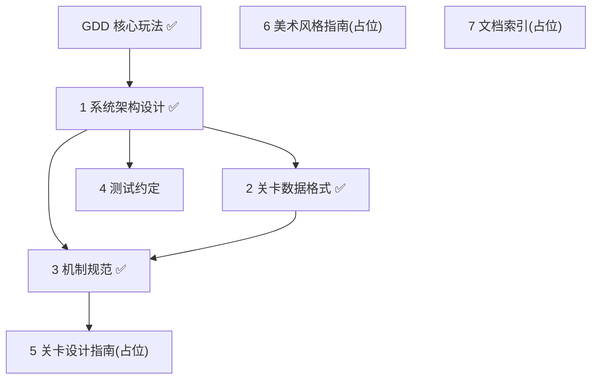

# 项目文档撰写计划 (Documentation Roadmap)

> **任务来源**: 用户请求「在编码之前完善文档」,GDD 核心玩法(spec)完成后,要求制定「**仅文档、不含代码**」的文档撰写路线图,作为持续文档工作的总纲。
> **任务内容**: 规划 monk 项目编码前的完整设计文档体系(核心 4 份 + 占位 3 份),定义依赖顺序、每份文档的目标 / 大纲 / 验收标准,以及统一的撰写流程。
> **参考文档**:
> - `docs/project/2026-07-08-gdd-design.md` —— GDD 核心玩法(本计划的源头与依赖根)
> - `CLAUDE.md`(项目根)—— 架构原则、代码规范、目录约定
> **生成日期**: 2026-07-08

> **For agentic workers:** 本计划为**纯文档撰写计划,不含任何代码实现**。每份文档作为一个独立任务,统一遵循「brainstorm 关键设计点 → 呈现设计逐节确认 → 写入文档 → 自审 → 用户复核 → 提交」流程。Steps 用 checkbox(`- [ ]`)跟踪。

**Goal:** 在编码之前,为 monk 项目建立完整的设计文档体系(GDD 已完成 + 4 份核心设计文档 + 3 份占位文档),作为后续编码的地基。

**Architecture:** 文档分层依赖:GDD(已完成)→ 系统架构 → 关卡数据格式 → 机制规范 → 测试约定;另有关卡设计指南 / 美术风格指南 / 文档索引 3 份占位。每份文档独立 brainstorm + 撰写 + 复核 + 提交。

**Tech Stack:** Markdown(简体中文);图表优先 Mermaid。

**关键约束(用户明确):** 本计划**仅涵盖文档撰写,不含任何代码实现步骤**。每份文档的「产物」= 文档本身;「验收」= 内容完整性 + 用户复核,替代代码场景下的 TDD 测试。

---

## 全局约束(每份文档遵守)

- **语言**:简体中文
- **文档头声明(强制)**:开头含「任务来源 / 任务内容 / 参考文档 / 生成日期」(全局 CLAUDE.md)
- **图表**:优先 Mermaid,除非 ASCII Flow 更能表达意图
- **编码 / 行尾**:UTF-8 / LF
- **存放**:**项目设计文档入 `docs/project/YYYY-MM-DD-<topic>-design.md`**(用户明确:项目文档不写入 superpowers 目录);流程 / 计划入 `docs/superpowers/plans/`
- **提交**:每份文档完成后独立 git commit(message 遵循项目中文风格,结尾 `Co-Authored-By: Claude <noreply@anthropic.com>`)
- **统一撰写流程**(每份文档):
  1. brainstorm 该文档的关键设计点(`superpowers:brainstorming`,一次一问至用户确认)
  2. 分节呈现设计草稿,逐节获用户确认
  3. 写入文档文件(含文档头声明)
  4. 自审(占位符 / 内部一致性 / 范围聚焦 / 歧义),就地修复
  5. 用户复核 spec 文件,按反馈修订
  6. git commit

## 文档依赖图

## 文档清单与状态

| # | 文档 | 路径 | 依赖 | 阶段 | 状态 |
|---|---|---|---|---|---|
| 0 | GDD 核心玩法 | `docs/project/2026-07-08-gdd-design.md` | — | 核心 | ✅ 已完成 |
| 1 | 系统架构设计 | `docs/project/2026-07-08-system-architecture-design.md` | 0 | 核心 | ✅ 已完成 |
| 2 | 关卡数据格式 | `docs/project/2026-07-09-level-data-format-design.md` | 1 | 核心 | ✅ 已完成 |
| 3 | 机制规范 | `docs/project/2026-07-09-mechanics-spec-design.md` | 1, 2 | 核心 | ✅ 已完成 |
| 4 | 测试约定 | `docs/project/YYYY-MM-DD-testing-convention-design.md` | 1 | 核心 | ⬜ 待撰写 |
| 5 | 关卡设计指南 | `docs/project/YYYY-MM-DD-level-design-guide-design.md` | 3 | 占位 | ⬜ 后续 |
| 6 | 美术风格指南 | `docs/project/YYYY-MM-DD-art-style-guide-design.md` | — | 占位 | ⬜ 后续 |
| 7 | 文档索引 | `docs/README.md` | 1~4 | 占位 | ⬜ 后续 |

> 路径中 `YYYY-MM-DD` 以实际撰写日为准。

---

## Task 1: 系统架构设计文档 ✅

**Files:**
- Create: `docs/project/2026-07-08-system-architecture-design.md`

**依赖:** GDD(`docs/project/2026-07-08-gdd-design.md`)

**目标:** 把 GDD 的玩法落地为模块职责划分与接口,使「机制数据驱动 + 状态确定性原则」有明确工程方案。

**内容大纲(章节级):**
1. 架构总览(分层、模块关系、数据流,含 Mermaid)
2. 网格模型(格子表示、坐标、四向邻接、瓦片类型枚举)
3. 机制系统(数据驱动框架:机制定义如何注册、查询通行性、触发效果;确定性状态管理)
4. 路径与状态管理(路径为唯一状态源;门 / 桥 / 机关 / 动态水状态由纯函数派生;撤销 = 截短路径)
5. 关卡系统(加载 .tres、构建网格、胜负判定)
6. UI 系统(HUD、关卡选择、撤销 / 重置控件;逻辑 / 表现分离)
7. 输入系统(桌面键盘 + 移动点击双输入归一)
8. 模块间接口(关键信号、方法签名预览)

**验收标准:**
- 覆盖 GDD 全部机制(障碍 / 门 / 机关 / 传送 / 桥 / 动态水)的状态推导路径
- 每个模块单一职责 + 明确接口,可独立理解与测试
- 状态确定性原则(GDD §4)有具体工程落地方案(路径 → 派生状态的纯函数)
- 逻辑 / 表现分离(CLAUDE.md 架构原则)在模块划分上体现

**撰写步骤:**
- [x] Step 1: brainstorm 架构关键设计点(模块划分方案、状态管理范式、机制注册方式),一次一问至用户确认
- [x] Step 2: 分节呈现架构设计草稿(按上述 8 章),逐节获用户确认
- [x] Step 3: 写入 spec 文件(含文档头声明)
- [x] Step 4: 自审(覆盖 GDD 全部机制?模块接口一致?确定性原则落地?有无占位 / 歧义),就地修复
- [x] Step 5: 用户复核 spec 文件,按反馈修订
- [x] Step 6: `git commit -m "docs: 新增系统架构设计文档"`

---

## Task 2: 关卡数据格式文档 ✅

**Files:**
- Create: `docs/project/2026-07-09-level-data-format-design.md`

**依赖:** Task 1(系统架构)

**目标:** 定义关卡 `.tres` Resource 字段结构,支持编辑器可视化编辑与批量制作(支撑 40~50+ 关持续扩展)。

**内容大纲(章节级):**
1. 设计目标(可视化编辑、批量制作、版本管理可 diff)
2. Resource 类层次(关卡 Resource、瓦片 / 格子 Resource、各机制配置 Resource)
3. 网格与瓦片表示(二维数据结构、坐标、瓦片类型枚举)
4. 各机制配置字段(门、机关、传送对、桥、动态水周期)
5. 机关 ↔ 门 / 桥映射(引用关系如何表达)
6. 起点与可选终点
7. 章节 · 进度数据(关卡归属章节、主线 / 分支标记、解锁条件)
8. 编辑器可视化编辑方案(`@export`、`@tool`、自定义 inspector)

**验收标准:**
- 字段足以表达 GDD 全部机制与关卡结构(含可选终点、机关映射、动态水周期、章节归属)
- 可在 Godot 编辑器可视化编辑
- `.tres` 为文本格式,利于 git diff 与版本管理

**撰写步骤:**
- [x] Step 1: brainstorm 数据格式关键设计点(Resource 类层次、映射表达、网格表示),一次一问至确认
- [x] Step 2: 分节呈现格式设计草稿,逐节确认
- [x] Step 3: 写入 spec 文件
- [x] Step 4: 自审(字段覆盖 GDD 全部机制?与架构机制系统吻合?可视化方案可行?),就地修复
- [x] Step 5: 用户复核
- [x] Step 6: `git commit -m "docs: 新增关卡数据格式设计文档"`

---

## Task 3: 机制规范文档 ✅

**Files:**
- Create: `docs/project/2026-07-09-mechanics-spec-design.md`

**依赖:** Task 1(系统架构)+ Task 2(关卡数据格式)

**目标:** 为每种机制给出数据定义 + 规则 + 状态确定性的形式化,作为机制实现与测试的权威依据。

**内容大纲(章节级):**
0. 总则(引用架构的机制系统框架;重述确定性原则形式化)
1. 障碍 · 假山
2. 障碍 · 流水(静态)
3. 门
4. 机关
5. 传送门
6. 桥
7. 动态水

> 每条机制统一含:**数据字段表**(对应 Task 2 的 Resource 字段)、**通行规则**、**状态推导公式**(路径 P 的纯函数)、**是否计入需扫**、**边角情形**(如多机关 OR、机关不可达导致无解、传送双向 / 不可达、动态水周期参数)。

**验收标准:**
- 与架构的机制系统框架(Task 1)、数据格式(Task 2)完全吻合,字段名一致
- 每机制状态均可表达为路径 P 的纯函数(确定性)
- 覆盖 GDD §7 全部 6 类机制,形式化无歧义
- 边角情形(无解、不可达、多机关)有明确处理

**撰写步骤:**
- [x] Step 1: brainstorm 各机制仍有分歧的细节(如传送强制语义、动态水周期默认值、机关 OR/AND),一次一问至确认
- [x] Step 2: 分机制呈现规范草稿,逐条确认
- [x] Step 3: 写入 spec 文件
- [x] Step 4: 自审(字段名与 Task 1/2 一致?每机制确定性可表达?边角覆盖?),就地修复
- [x] Step 5: 用户复核
- [x] Step 6: `git commit -m "docs: 新增机制规范文档"`

---

## Task 4: 测试约定文档

**Files:**
- Create: `docs/project/YYYY-MM-DD-testing-convention-design.md`

**依赖:** Task 1(系统架构)

**目标:** 确立 TDD 流程与测试结构,确保状态确定性原则与各机制规则可被测试覆盖。

**内容大纲(章节级):**
1. 测试框架选型(GUT —— Godot Unit Test)
2. 安装与集成(`addons/gut`)
3. 测试目录结构(镜像 `scripts/` 子系统结构)
4. TDD 流程(红 - 绿 - 重构,适配 GDScript)
5. 关键测试场景:
   - 路径校验(不重复、正交邻接、传送逻辑邻接)
   - 状态确定性回滚(撤销后门 / 桥 / 动态水状态正确回滚)
   - 各机制规则(门开闭、桥铺放、动态水水位、传送)
   - 胜负判定(覆盖需扫格、可选终点)
   - 关卡可解性(可选,设计期工具)
6. 运行测试(编辑器内 / 命令行)

**验收标准:**
- 明确「测什么、怎么测、目录在哪、如何运行」
- 确定性原则(GDD §4)可被测试覆盖(撤销回滚测试)
- 与架构(Task 1)的模块边界对应

**撰写步骤:**
- [ ] Step 1: brainstorm 测试约定关键点(GUT 版本、目录结构、TDD 严格度),一次一问至确认
- [ ] Step 2: 分节呈现约定草稿,逐节确认
- [ ] Step 3: 写入 spec 文件
- [ ] Step 4: 自审(覆盖关键场景?与架构模块对应?运行命令明确?),就地修复
- [ ] Step 5: 用户复核
- [ ] Step 6: `git commit -m "docs: 新增测试约定文档"`

---

## Task 5: 关卡设计指南(占位)

**依赖:** Task 3(机制规范)
**目标:** 关卡设计方法论——可解性保证、难度曲线、章节节奏、机制组合范式。
**触发时机:** 机制规范完成后,且有首批实际关卡设计经验时。
**状态:** ⬜ 占位(用户要求现在占位),暂不撰写。

## Task 6: 美术风格指南(占位)

**依赖:** 无(待美术方向确定,见 GDD §10)
**目标:** 美术基调、配色、tile 风格、动画原则。
**触发时机:** 美术方向确定后。
**状态:** ⬜ 占位(用户要求现在占位),暂不撰写。

## Task 7: 文档索引(占位)

**依赖:** Task 1~4(核心文档完成)
**目标:** `docs/` 导航索引,汇总所有文档、依赖关系与撰写状态。
**触发时机:** 核心 4 份文档完成后。
**状态:** ⬜ 占位(用户要求现在占位),暂不撰写。

---

## 执行说明

本计划为**文档路线图**,执行方式为「逐份文档协作撰写」——由我与用户共同 brainstorm → 撰写 → 复核 完成,**非 subagent 批量执行代码任务**。

每完成一份文档:
1. 勾选该 Task 的 checkbox
2. 更新上方「文档清单与状态」表的「状态」列(⬜ → ✅)
3. 进入下一份(按依赖顺序)

撰写顺序固定为:Task 1 → Task 2 → Task 3 → Task 4(Task 2 / 3 / 4 依赖 Task 1,Task 3 还依赖 Task 2)。Task 5~7 为占位,待触发时机成熟再撰写。
