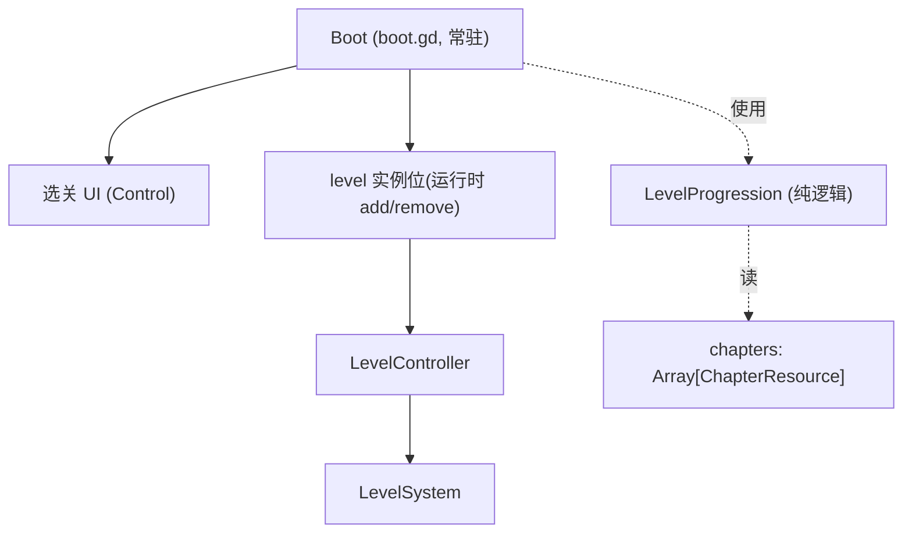
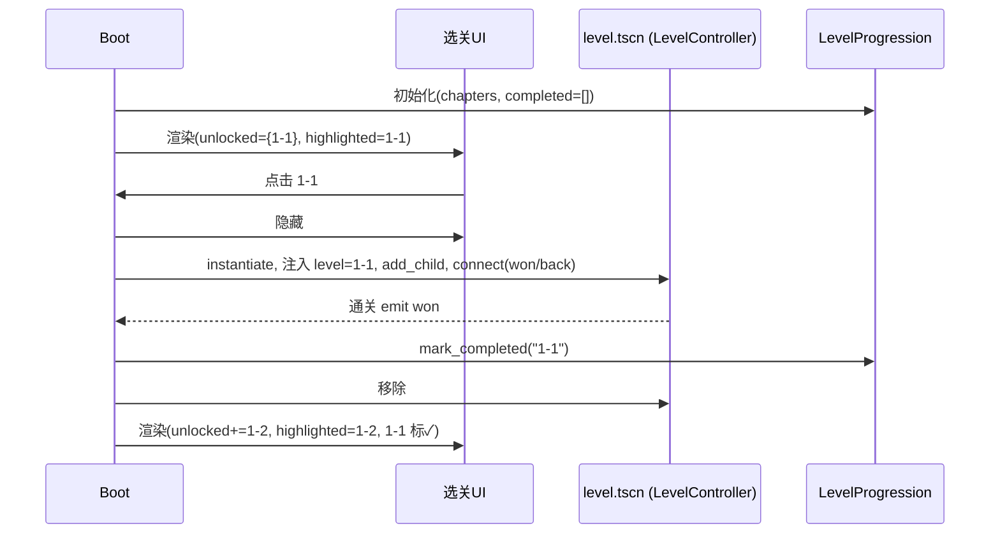

# 设计规范:monk 首批正式关卡 + 章节选关入口

> **任务来源**: 关卡设计工具全增量完成后(merge e458226,106 测试绿),进入「首批正式关卡」阶段。用户选择「首批关卡 + 最小入口」方向,以验证核心循环 + fun + 工具实战,并为关卡设计指南补实例。经 brainstorm 多轮澄清,范围确定为:章节1+2 共 8 关 + ChapterResource 章节结构 + 章节选关 UI + 内存解锁(不存档)。
> **任务内容**: 定义首批 8 关的产出蓝图、章节/选关入口的架构与数据结构、解锁与高亮逻辑、组件改动、测试与验证策略。**求解器(自动可解性验证)按用户要求后置,另行讨论实现难度,不在本 spec 范围。**
> **参考文档**:
> - `docs/project/2026-07-09-level-design-guide-design.md` — 关卡设计方法论(路径优先、难度曲线、机制引入、引导)
> - `docs/project/2026-07-09-level-data-format-design.md` — LevelResource / ChapterResource 数据格式
> - `docs/project/2026-07-08-gdd-design.md` — GDD(玩法、§5 死局不提示、§8 关卡进度)
> - `docs/project/2026-07-09-mechanics-spec-design.md` — 机制规范(门/机关语义)
> - `docs/superpowers/specs/2026-07-12-level-tool-autogen-design.md` — PathGenerator(autogen 生产策略依赖)
> **生成日期**: 2026-07-12

| 字段 | 值 |
|---|---|
| 日期 | 2026-07-12 |
| 状态 | 设计已确认,待 spec 复核 |
| 产物路径 | `docs/superpowers/specs/2026-07-12-first-levels-and-select-design.md`(本文件) |
| 产出流程 | superpowers:brainstorming →(用户复核)→ writing-plans → 实施 |
| 上游 | 关卡设计指南、关卡数据格式、GDD、机制规范、关卡工具(autogen) |

## 1. 背景与目标

关卡设计工具(MVP + 机制标注 + undo + obstacle + drag + autogen)已全部完成。下一步用其产出**首批正式关卡**,达成:

1. **验证核心循环**:覆盖 / 不重复 / 撤销 / 通关 在真实关卡里跑通
2. **验证机制系统**:门 + 机关(机制数据驱动)在真实关卡里的效果
3. **验证 fun 与引导**:难度递进、结构引导(死局不提示下)是否成立
4. **工具实战**:autogen 与手画两条生产路径都走通,暴露工具不足
5. **补关卡设计指南实例**:指南目前为方法论无实例,首批 8 关作实例补入

**现状缺口**(本 spec 要填):

- `Scenes/boot.tscn` 是空壳(仅空 Control),无入口逻辑
- `Scenes/level.tscn` 硬编码加载 `test_level_01.tres`,无法切换关卡
- 无选关 UI、无通关流转、无章节 / 解锁概念
- `resources/levels/` 仅有 3 个 test_level(测试用,非正式)

## 2. 关键决策摘要

| # | 决策点 | 决策 | 理由 | 否决的替代 |
|---|---|---|---|---|
| D1 | 入口架构 | **boot 常驻**,实例化 level.tscn 为子节点,add/remove child 切换 | 解锁状态局部于 boot 节点,避免全局可变状态,契合项目「状态确定性 / 避免全局」原则 | autoload 单例 GameFlow + change_scene:引入全局可变状态,违背原则(虽贴 Godot 多场景惯例、未来存档更顺) |
| D2 | 通关后流转 | 回选关列表,**不自动进下一关**;列表高亮「下一关」 | YAGNI——列表本可跳任意解锁关;高亮保留连续引导 | 自动进下一关:体验顺但非必需,首批不做 |
| D3 | ChapterResource 范围 | 简化:仅 `id` / `display_name` / `main_levels`;**不做** branches / unlock_condition;线性解锁硬编码 | YAGNI + 不存档;unlock_condition 原留实现期,首批线性流程足够 | unlock_condition 数据化(前置关卡 id 列表):首批用不上,过度设计 |
| D4 | 解锁 / 高亮逻辑归属 | 抽纯逻辑类 `LevelProgression`(可测),boot.gd 仅 UI 绑定 | 逻辑 / 表现分离(架构原则),解锁规则可 GUT 测 | 逻辑直接进 boot.gd:场景脚本难测 |
| D5 | 存档 | **不做** SaveSystem,内存解锁(重启重置) | 用户明确选「不存档」;原型 / 验证期 YAGNI | SaveSystem autoload 持久化:首批不需要,留待正式化期 |
| D6 | 关卡生产策略 | **混合**:章节1 autogen 骨架 + 手改;章节2(1-5 与门机关关)手画 | 兼顾速度(简单关复用 autogen)与质量(机制关需精心摆机关) | 全 autogen:雷同无设计感、无法保证机关先于门;全手画:慢,简单关性价比低 |
| D7 | 难度递进参数 | 网格 5×5→7×7;终点 不限→指定;障碍 无→稀疏→密集→瓶颈;机制 无→单机关→多机关→综合 | 承接关卡设计指南 §5 / §6 / §9 | — |
| D8 | 自动可解性验证(求解器) | **后置**,首批不做;靠路径优先法(解即证)+ validate + 人工 QA | 用户要求另行讨论求解器实现难度 | 求解器首批实现:成本与机制覆盖待评估,见 §12 |

## 3. 架构:boot 常驻(D1)

`boot.tscn` 作为常驻根节点,整局游戏不销毁,持有章节列表与解锁状态。选关 UI 是 boot 的子节点;点关后实例化 `level.tscn` 为 boot 的子节点并注入关卡,通关或返回时移除该实例。



**关卡加载参数化**:`level.tscn` 的 `level_controller.level` 不再硬绑 `test_level_01`;boot 在 `add_child` 前赋值 `level_controller.level = X`,`_ready` 时 level 已就位 → `load` 正常。`@export level` 保留 `test_level_01` 作 fallback(单独运行 `level.tscn` 仍可玩,便于开发调试)。

## 4. 数据结构(D3)

### 4.1 ChapterResource(简化)

```gdscript
class_name ChapterResource
extends Resource

@export var id: String                  # "ch1"
@export var display_name: String        # "前院"
@export var main_levels: Array[LevelResource]
```

**不做** `branches` / `unlock_condition`(level-data-format §8 原定义,本批不实现)。解锁逻辑由 `LevelProgression` 按线性规则推导,不进数据。

### 4.2 资源组织

```
resources/
├── chapters/
│   ├── chapter_01.tres   # 前院(1-1~1-5)
│   └── chapter_02.tres   # 后山(2-1~2-3)
└── levels/
    ├── l1_1.tres … l1_5.tres
    ├── l2_1.tres … l2_3.tres
    └── test_level_01~03.tres   # 保留(开发/测试)
```

章节 `.tres` 由 boot 显式加载:`load("res://resources/chapters/chapter_01.tres")` 等(首批仅 2 章,硬编码路径;未来多章再改为目录扫描)。

### 4.3 关卡 id 约定

`LevelMeta.id` 用 `{chapter}-{level}` 格式:`"1-1"` ~ `"1-5"`、`"2-1"` ~ `"2-3"`。`LevelProgression` 以此 id 为解锁 / 高亮的 key。

## 5. 选关与解锁(D2 / D4)

### 5.1 LevelProgression(纯逻辑,可测)

```gdscript
class_name LevelProgression
extends RefCounted

# chapters: Array[ChapterResource];completed: Array[String] 已通关 level id
func _init(chapters: Array, completed: Array) -> void: ...

func unlocked_ids() -> Array[String]        # 当前已解锁 level id 集合
func highlighted_id() -> String             # 下一关(首个已解锁未通关);全通关则 ""
func mark_completed(level_id: String) -> void   # 通关一关,更新内部状态
```

**线性规则**:把所有章节的 `main_levels` 按顺序拍平为一条序列 `[1-1, 1-2, …, 1-5, 2-1, 2-2, 2-3]`。

- 初始:`unlocked = {1-1}`,其余锁定。
- 通关序列第 N 关 → 解锁第 N+1 关(跨章节自然衔接:通关 1-5 → 解锁 2-1)。
- `highlighted` = 序列中首个「已解锁且未通关」的关;全部通关则返回 `""`。

> 纯函数式推导(给定 chapters + completed 即可算出 unlocked / highlighted),无副作用,GUT 易测。boot.gd 持有一个实例,通关时 `mark_completed` 后重新读 `unlocked_ids()` / `highlighted_id()` 刷新 UI。

### 5.2 选关 UI 渲染(boot.gd 表现层)

- 遍历 chapters × main_levels,每关一个 Button,文字为 `display_name`。
- 未解锁按钮 disabled(灰显);已解锁可点。
- `highlighted_id()` 对应按钮加高亮样式(不同底色 + 「▶」前缀)。
- 通关的关显示「✓」。

### 5.3 通关与返回流转

- **通关**:`level_controller` emit `won` → boot 读 `level_controller.level.meta.id` → `LevelProgression.mark_completed(id)` → 移除 level 实例 → 刷新并显示选关 UI(下一关已解锁 + 高亮)。
- **返回**:`level_controller` emit `back_requested`(来自 HUD「返回列表」按钮)→ boot 移除 level 实例 → 显示选关 UI(不解锁)。

## 6. 组件改动清单

| 组件 | 改动 | 新增/改 |
|---|---|---|
| `scripts/level/chapter_resource.gd` | 新建:`id` / `display_name` / `main_levels` | 新增 |
| `scripts/level/level_progression.gd` | 新建:解锁 / 高亮纯逻辑 | 新增 |
| `scripts/ui/boot.gd` | 新建:加载章节、渲染选关 UI、实例化 / 移除 level、通关 / 返回回调 | 新增 |
| `Scenes/boot.tscn` | 根节点挂 boot.gd + 选关 UI 子节点(替换空 Control) | 改 |
| `scripts/level/level_controller.gd` | 加 `won` / `back_requested` 信号;`won` 首次通关 emit 一次;连接 HUD back | 改 |
| `scripts/ui/hud.gd` | 加「返回列表」按钮 + `back_pressed` 信号 | 改 |
| `Scenes/level.tscn` | `level` 保留 test_level_01 作 fallback(不再作主加载源) | 改(约定) |
| `resources/chapters/chapter_01.tres`、`chapter_02.tres` | 新建:章节资源 | 新增 |
| `resources/levels/l1_1.tres … l2_3.tres` | 新建:8 关(工具产出) | 新增 |

## 7. 数据流



## 8. 关卡蓝图(8 关,D7)

**章节 1 · 前院(纯路径 + 障碍,5 关)**

| id | 关名 | 网格 | 起点→终点 | 障碍/机制 | 学习目标 | 生产 |
|---|---|---|---|---|---|---|
| 1-1 | 初扫 | 5×5 | 角→不限 | 无 | 核心循环:全覆盖 / 不重复 / 撤销 | 全空(必然可解) |
| 1-2 | 石径 | 5×5 | 角→不限 | 2 假山 | 障碍绕行 | random_walk + Filler |
| 1-3 | 曲径 | 5×5 | 角→不限 | 3~4 假山(瓶颈) | 结构引导(窄处暗示方向) | random_walk + Filler + 手改 |
| 1-4 | 溪畔 | 6×6 | 角→不限 | 假山 + 流水 | 流水 = 另一种障碍 | random_walk + Filler(混障碍) |
| 1-5 | 前院终 | 6×6 | 角→指定角 | 密集假山 | 指定终点收紧约束 | 手画解(保证终点可达) |

**章节 2 · 后山(门 + 机关,3 关)**

| id | 关名 | 网格 | 起点→终点 | 障碍/机制 | 学习目标 | 生产 |
|---|---|---|---|---|---|---|
| 2-1 | 叩门 | 6×6 | 角→不限 | 1 门 + 1 机关 + 少量假山 | 触发:机关先于门 | 手画(机关置于门前路径段) |
| 2-2 | 重门 | 6×6 | 角→不限 | 2 门 + 机关(序列 / OR) | 多门 / 多机关组合 | 手画 |
| 2-3 | 后山终 | 7×7 | 角→指定角 | 门 + 机关 + 假山综合 | 综合、接近单解 | 手画 |

> 关名与具体障碍 / 机制摆放为实现期在 LevelDesigner 工具里细化;本表是蓝图(学习目标 + 规模 + 机制引入点 + 生产方式)。

## 9. 生产策略(D6)

- **章节 1(1-1~1-4)**:LevelDesigner 内用 PathGenerator 生成骨架(`heuristic` 全图 / `random_walk` 部分路径)→ Filler 填障碍(假山 `WALL` / 流水 `FLOWING_WATER`)→ 局部手改起终点与路径形状 → 标注 meta → 导出 `.tres`。天然可解(路径优先法)。
- **1-5 与章节 2(2-1~2-3)**:手画解路径(指定终点可达 / 机关置于门前路径段)→ Filler → 标注门 `DoorData` + 机关 `LeverData`(`MechanicOrderValidator` 校验机关先于门)→ 导出。
- 每关导出后:`LevelSystem.validate()` 无错 + 工具内 MechanicOrderValidator 通过 + 人工玩通。

## 10. 测试与验证

**验证三层**:

| 层 | 内容 | 方式 |
|---|---|---|
| 数据自洽 | 每关 `.tres` 加载后 `validate()` 无错 | GUT 自动(参数化遍历 levels/) |
| 可解性 | 路径优先法保证(解即证)+ 人工玩通 | 设计期 + 人工 QA(求解器后置,见 D8) |
| 实际体验 | 每关 fun、引导有效、难度递进顺畅 | 人工 QA |

**GUT 测试清单(新增)**:

- `test_level_progression.gd`:初始仅 1-1 解锁;通关 N 解 N+1;通关 1-5 解锁 2-1(跨章);highlighted 推导;全通关 highlighted=""
- `test_chapter_resource.gd`:ChapterResource 加载 / 字段 / main_levels 顺序
- `test_levels_valid.gd`(参数化):遍历 `resources/levels/l*.tres`,每关 `validate()` 无错
- `test_boot_flow.gd`(轻):level_controller 接收注入 level 加载成功;首次通关 emit `won` 一次(不重复);HUD 返回按钮 → `back_requested`

> `test_levels_solvable.gd` / 求解器相关:**后置**(D8),本批不做。

**人工 QA 清单(用户执行)**:

- 编辑器启用 LevelDesigner 产 8 关 → 导出
- 运行游戏,从选关 UI 逐关玩通
- 确认:通关回列表 + 下一关高亮;门机关关引导(机关靠近门);难度递进顺畅;无频繁死局挫败

## 11. 验收

- [ ] boot.tscn 不再是空壳:启动即选关 UI,初始仅 1-1 可点且高亮
- [ ] 选关 → 加载对应关 → 可玩;通关回列表且下一关解锁 + 高亮;返回按钮可用
- [ ] 8 关 `.tres` 产出,均 `validate()` 无错,人工玩通
- [ ] ChapterResource 2 个(前院 / 后山),main_levels 顺序正确
- [ ] LevelProgression GUT 测试覆盖解锁 / 跨章 / 高亮规则
- [ ] 难度递进符合蓝图(规模 / 终点 / 障碍 / 机制逐步)
- [ ] 关卡设计指南补入首批实例(复盘)

## 12. 后续 / 开放问题

- **求解器(D8,待讨论)**:自动可解性验证的实现难度——DFS 基于 `PathState.move/undo` 的机制语义覆盖范围(首批仅障碍 + 门机关;桥 / 传送 / 动态水需扩展)、性能(5×5~7×7)、求解器自身的正确性测试。用户要求另行讨论,确定后再补 spec 与 plan。
- **存档系统(D5)**:正式化期引入 SaveSystem(autoload)持久化 unlocked;届时 LevelProgression 状态序列化到 `user://`。
- **ChapterResource 完整化(D3)**:未来需要分支 / 隐藏关 / 条件解锁时,补 `branches` / `unlock_condition`,解锁逻辑从 LevelProgression 线性规则迁到数据驱动。
- **章节主题美术耦合**:前院 / 后山的最终视觉见美术风格指南(Task 6)。
- **关卡难度量化**:为排序与玩家测试提供客观指标(关卡设计指南 §14 开放问题)。
