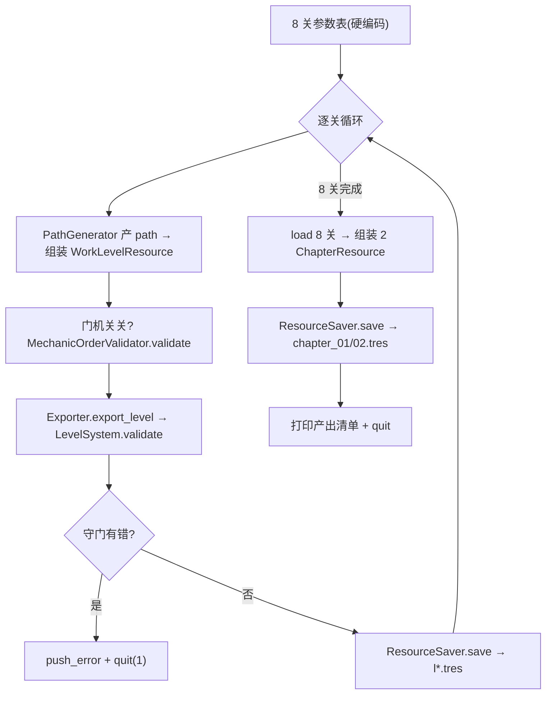

# 设计规范:monk 首批关卡 headless 产关脚本

> **任务来源**: 首批关卡选关入口系统已 merge main(dbc3215,123 测试绿),进入 first-levels-and-select spec §8「关卡蓝图」的执行阶段。原 §9 生产策略为「编辑器 GUI 手画」,但实测 headless 脚本产关可行(`PathGenerator`/`Filler`/`Exporter` 均为纯静态函数,不依赖 `@tool`/编辑器 UI),经 brainstorm 三轮澄清,确定改用「headless 脚本一次性产 8 关 + 2 章」,取向「闭环优先」,求解器本轮不碰。
> **任务内容**: 定义一次性 headless 产关脚本的形态、8 关参数蓝图、章节产出、守门与验证链路、已知技术债与验收标准。
> **参考文档**:
> - `docs/superpowers/specs/2026-07-12-first-levels-and-select-design.md` — 首批关卡 + 选关入口主 spec(§8 关卡蓝图、§9 生产策略、§4 资源组织、§10 测试)
> - `docs/superpowers/specs/2026-07-12-level-tool-autogen-design.md` — PathGenerator 生产策略依赖(spiral/hilbert/heuristic/random_walk)
> - `docs/project/2026-07-09-level-data-format-design.md` — LevelResource / ChapterResource / LevelMeta 数据格式
> - `docs/project/2026-07-09-level-design-guide-design.md` — 关卡设计方法论(路径优先法:画解→填障碍→天然可解)
> **生成日期**: 2026-07-12

| 字段 | 值 |
|---|---|
| 日期 | 2026-07-12 |
| 状态 | 设计已确认,待 spec 复核 |
| 产物路径 | 本文件 |
| 产出流程 | superpowers:brainstorming →(用户确认设计)→ 写 spec →(用户复核)→ writing-plans → 实施 |
| 上游 | first-levels-and-select spec、autogen spec、关卡数据格式、关卡设计指南 |

## 1. 背景与目标

入口系统已就绪并 merge(boot 常驻、`ChapterResource`、`LevelProgression`、选关 UI、`level_controller.won/back_requested`、`test_levels_valid` 均在 dbc3215)。当前唯一缺口:`resources/levels/` 仅有 3 个 `test_level_*.tres`(测试用),**首批 8 关 + 2 章正式 `.tres` 尚未产出**,boot 启动后选关 UI 无正式关可选。

本 spec 填这个缺口。目标(闭环优先):

1. 用一次性 headless 脚本产出 8 关 `.tres` + 2 章 `.tres`,让「boot 选关 → 玩通 → 通关 → 解锁下一关」端到端可跑
2. 路径优先法保证天然可解(解即证),无需求解器
3. 守门(`validate` + `MechanicOrderValidator` + GUT)保证数据自洽
4. 设计感 / 难度曲线精雕留后续 QA 驱动迭代(闭环优先的明确取舍)

## 2. 关键决策摘要

| # | 决策点 | 决策 | 理由 | 否决的替代 |
|---|---|---|---|---|
| G1 | 产关方式 | headless 脚本一次性产全部 | `PathGenerator`/`Filler`/`Exporter` 均纯静态函数,headless 可直调;可重跑、可版本管理、无需用户在编辑器操作 | 编辑器 GUI 手画(原 §9):需用户大量操作、产出慢;LevelDesigner 插件加「批量产关」菜单:过度设计,违反 YAGNI/闭环优先 |
| G2 | 脚本组织 | 单一一次性脚本 `generate_first_levels.gd`(`extends SceneTree`) | 8 关参数集中、可重跑、留存作「8 关怎么来的」溯源 | 每关独立小脚本:分散无收益;插件长期功能:违反闭环优先 |
| G3 | 取向 | 闭环优先(MVP 骨架) | first-levels-and-select spec §1 首批目标是原型验证核心循环/机制/fun,**非**正式发布质量;路径优先法天然可解,骨架即可玩 | 质量优先:产出慢,设计感后续 QA 驱动迭代更高效;分批(先章 1 后章 2):8 关量小不必拆 |
| G4 | 章节路径 | 硬编码 `chapter_01.tres`/`chapter_02.tres`(boot.`chapter_paths` 已默认指向) | 首批仅 2 章,YAGNI | 目录扫描:过度设计 |
| G5 | 章节内关卡引用 | 先存 8 关 → `load` 组装 chapter → 存(chapter.tres 用 `ext_resource` 引用各关) | 引用已存关卡,不内联,保持单关独立可改、可单独 validate | 内联:关卡重复存储,改一关要改多处 |
| G6 | 确定性 | 本轮不给 `random_walk` 加 seed,`.tres` 存盘即固化 | 避免改动既有 `PathGenerator` 签名(外科手术式原则,避免影响工具与既有测试);存盘后关卡固定,无需重跑 | 加 seed:需改 `PathGenerator` 签名;列为本轮技术债,后续按需 |
| G7 | 求解器 | 本轮不碰 | 产关用路径优先法天然可解,不依赖求解器;求解器成本高,first-levels-and-select spec §12 已标「待讨论」 | 本轮顺便实现:超闭环优先范围,显著拉长周期 |

## 3. 脚本形态与跑法

`scripts/tool/generate_first_levels.gd`:

```gdscript
extends SceneTree

func _init() -> void:
    _run()
    quit()
```

`_run()` 流程:



跑法(两步:先 import 确保 class_name/uid 识别,再跑脚本):

```bash
"$GODOT" --headless --path . --import
"$GODOT" --headless --path . -s res://scripts/tool/generate_first_levels.gd
```

## 4. 8 关参数蓝图(承接 first-levels-and-select spec §8,闭环优先简化)

闭环优先 = 路径形状交给 generator,天然可解即可,精雕留后续。`random_walk` 不指定 end(`Vector2i(-1,-1)`)= 部分路径(随机走直到 stuck),`Filler` 自动把未覆盖格填障碍(边界 `WALL` / 内部 `FLOWING_WATER`),天然可解。

| id | display_name | difficulty | size | start | goal | 生成策略 | 机制 | chapter_id |
|---|---|---|---|---|---|---|---|---|
| 1-1 | 初扫 | 1 | 5×5 | (0,0) | 不限 | `heuristic` 全图(全覆盖→全空) | 无 | ch1 |
| 1-2 | 石径 | 2 | 5×5 | (0,0) | 不限 | `random_walk` 部分路径 | 无(Filler 自动障碍) | ch1 |
| 1-3 | 曲径 | 3 | 5×5 | (0,0) | 不限 | `random_walk`(同 1-2,雷同见注) | 无 | ch1 |
| 1-4 | 溪畔 | 4 | 6×6 | (0,0) | 不限 | `random_walk` | 无(混 WALL + 流水) | ch1 |
| 1-5 | 前院终 | 5 | 6×6 | (0,0) | (5,5) | `random_walk(start, end)` | 无 | ch1 |
| 2-1 | 叩门 | 6 | 6×6 | (0,0) | 不限 | `heuristic` 全图 | 1 lever + 1 door | ch2 |
| 2-2 | 重门 | 7 | 6×6 | (0,0) | 不限 | `heuristic` 全图 | 2 lever + 2 door(各控一门) | ch2 |
| 2-3 | 后山终 | 8 | 7×7 | (0,0) | 不限 | `heuristic` 全图 | 1 lever + 1 door | ch2 |

**门机关关机制摆放**:在 path 上取**前段**某格为 `LeverData`(id=`"lvN"`),**后段**某格为 `DoorData`(lever_ids=`["lvN"]`);`MechanicOrderValidator` 校验 lever 在 door 之前(index_of[lever] < index_of[door])。门可通行语义 = `is_lever_pressed`(lever coord 已在 path 中)。

> 关名沿用 spec §8;具体路径形状 / 障碍布局 / 机关格位由 generator + 脚本自动选取,不手工指定(闭环优先取舍,见 §8 技术债)。
>
> **1-2 / 1-3 雷同说明**:本轮二者均为 5×5 `random_walk`(不指定 end),`random_walk` 路径长度由随机走决定、不可控,故 1-2 与 1-3 实际布局可能雷同。这是闭环优先的明确取舍;QA 后用 `obstacle_overrides` 在 1-3 中央加 WALL 制造瓶颈区分,或转编辑器手改。
>
> **门机关关全空说明**:2-1/2-2/2-3 本轮用 `heuristic` 全图 path(Filler 全空、无假山),以保证 path 足够长稳定摆 lever/door(避免 `random_walk` 路径过短致机关摆位失败、脚本非确定性失败);2-3 并放弃指定终点。与 §8 蓝图「2-1 少量假山 / 2-3 综合 + 指定终点」有差距,留 QA 迭代(`obstacle_overrides` 加假山 / `random_walk(start,end)` 收紧终点)。

## 5. chapter 产出

| 文件 | id | display_name | main_levels |
|---|---|---|---|
| `resources/chapters/chapter_01.tres` | ch1 | 前院 | l1_1 … l1_5 |
| `resources/chapters/chapter_02.tres` | ch2 | 后山 | l2_1 … l2_3 |

先存 8 关 → `load` 8 个 `LevelResource` → append 进 `ChapterResource.main_levels` → `ResourceSaver.save`。chapter.tres 用 `ext_resource` 引用各关(不内联,见 G5)。

## 6. 守门与验证

**产关时(脚本内,每关)**:

- Exporter 前(门机关关):`MechanicOrderValidator.validate(path, mechanics)` — 机关先于门 / 传送相邻 / 动态水低水位
- Exporter 后:`LevelSystem.new().validate(lr)` — 机制坐标越界 / lever_id 引用存在 / 传送成对 / 起/终点非传送门
- 任一返回非空 → `push_error` + `quit(1)`,脚本中断

**GUT 自动覆盖(无需新增测试,既有测试已覆盖)**:

- `test_levels_valid.gd`:遍历 `resources/levels/*.tres` 全部 `.tres`(不限 `test_` 前缀)→ 新 8 关自动纳入 `validate` 守门
- `test_chapter_resource.gd`:`ChapterResource` 字段(已存在)
- `test_level_progression.gd`:解锁 / 跨章 / 高亮规则(已存在,内存构造,不依赖 .tres)

## 7. 产出文件清单

- `scripts/tool/generate_first_levels.gd`(新增,一次性脚本)
- `resources/levels/l1_1.tres` … `l1_5.tres`(5)
- `resources/levels/l2_1.tres` … `l2_3.tres`(3)
- `resources/chapters/chapter_01.tres`、`chapter_02.tres`(2)

## 8. 已知技术债(本轮不处理)

- **确定性**:`random_walk` 内部 `shuffle`,重跑路径变化;`.tres` 存盘即固化,无需重跑。后续可给 `PathGenerator` 加可选 `seed` 参数以可复现(会改签名,需同步工具与测试)。
- **设计感**:random_walk 形状随机,瓶颈 / 难度曲线不保证。用户 QA 后针对性迭代(改参数,或转编辑器手改特定关)。
- **门机关关全空**:2-1/2-2/2-3 本轮 `heuristic` 全图(无假山、2-3 无指定终点),为确定性稳健摆位。QA 后用 `obstacle_overrides` 加假山、`random_walk(start,end)` 收紧终点。
- 关卡难度量化、求解器(D8)、LevelDesigner 框选 / 多机关 OR / inspector 完善:见 first-levels-and-select spec §12。

## 9. 验收

- [ ] 脚本 headless 跑完无 `push_error`,8 关 + 2 章 `.tres` 产出
- [ ] GUT 测试全绿(`test_levels_valid` 自动覆盖新 8 关 + 既有 `test_chapter_resource` / `test_level_progression`)
- [ ] 用户 F5 端到端 QA:选关 → 玩通 → 通关回列表 + 下一关 ▶ 高亮 + 本关 ✓(人工,本 spec 范围外,列入交付清单)

## 10. 后续

- 用户 QA 反馈 → 针对性改关卡参数(网格 / 起终点 / 机制数量 / 机关位置)或转编辑器手改特定关 → 重跑脚本或手改 .tres
- 求解器(D8)单独 brainstorm(DFS 基于PathState.move/undo、机制覆盖、5×5~7×7 性能、求解器自身测试)
- 关卡设计指南补首批 8 关实例复盘
