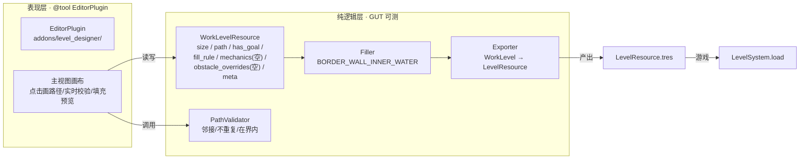

# 实施设计:monk 关卡设计工具 MVP(路径优先法 · 最小闭环)

> **任务来源**: 机制系统完整(7 类机制全齐)+ 技术债清理后,用户选「关卡设计工具」为下一步方向;经 superpowers:brainstorming 确定首批范围为「最小路径闭环 MVP」、工具形态为「EditorPlugin + 自定义主视图」。本 spec 是**实施级**(区分于已有设计级 spec),锁定首批范围、决策理由与任务切片,供 writing-plans 落实。
> **任务内容**: 实现路径优先法关卡设计工具的最小闭环——`@tool` EditorPlugin + 自定义主视图(逐格点击画路径)+ 智能填充 + 导出 `LevelResource` + 基础校验。纯逻辑(模型/校验/填充/导出)抽成独立可测模块,GUT 严格 TDD 全覆盖;表现层(EditorPlugin/主视图)手动验证。
> **参考文档**:
> - `docs/project/2026-07-09-level-design-tool-design.md` — 设计级 spec(路径优先法、`WorkLevelResource`、LD1-LD5 决策、§13 开放问题)
> - `docs/project/2026-07-09-level-data-format-design.md` — `LevelResource` 运行格式
> - `docs/project/2026-07-09-mechanics-spec-design.md` — 机制规范(§7 校验)
> - `scripts/level/level_resource.gd` `level_meta.gd` `scripts/grid/grid_model.gd` — 现状接口(B1 复核确认吻合)
> **生成日期**: 2026-07-12

| 字段 | 值 |
|---|---|
| 日期 | 2026-07-12 |
| 状态 | 实施级 spec,待用户审 → writing-plans |
| 产物路径 | `docs/superpowers/specs/2026-07-12-level-design-tool-mvp-design.md`(本文件) |
| 产出流程 | superpowers:brainstorming(范围切片 + 工具形态 2 轮决策)→ 本文档 → writing-plans |
| 上游 | 设计级 spec、关卡数据格式、机制规范、现状代码 |
| 下游 | writing-plans 逐步实施计划 |

## 1. 范围(MVP 最小路径闭环)

**纳入**:
- `WorkLevelResource` 工作模型(设计级 spec §4 字段;首批 `mechanics`/`obstacle_overrides` 留空占位,前向兼容)
- `PathValidator`(正交邻接 / 不重复 / 在界内)
- `Filler`(`BORDER_WALL_INNER_WATER` 智能填充)
- `Exporter`(`WorkLevelResource` → `LevelResource`)
- `EditorPlugin` + 主视图(左键画路径 + 清空 + 导出)

**不纳入(明确延后,见 §2 决策理由)**:
- 机制标注 + 路径顺序校验(工具差异化核心,下一批次)
- 拖拽画路径 / 自动随机生成(设计级 spec §7 LD4)
- `obstacle_overrides` 逐格微调 UI(设计级 spec §5 步 5;字段保留)
- undo(path 编辑撤销)
- `FillRule` 其他策略 / 章节批量 / inspector 自定义(设计级 spec §13)

## 2. 关键决策与理由(避免长期遗忘)

| # | 决策 | 理由 | 弃选替代及其原因 |
|---|---|---|---|
| D1 | 首批范围 = 最小路径闭环(不含机制) | `@tool` 插件 / `WorkLevelResource` / 导出器 / 可解性闭环是有架构风险的新地基,先小步验证;机制标注建立其上更稳(YAGNI + 增量交付) | 「路径 + 机制标注」一步到位:首批工作量与风险叠加,违背增量交付 |
| D2 | 工具形态 = EditorPlugin + 自定义主视图 | 设计级 spec §6 原意,正统、可扩展、交互体验好;纯逻辑抽离后视图是薄层,风险可控 | `@tool Node2D` 场景内画:Godot 场景编辑器格子点击输入 hacky、体验受限、后续需重写为 EditorPlugin(重复劳动);纯逻辑 + inspector 手填 path:失去「可视化点击画路径」核心价值,沦为代码工具 |
| D3 | 纯逻辑(校验/填充/导出)独立可测模块 | 贯彻项目「逻辑/表现分离」核心原则;`@tool` 表现层难单测,抽离纯函数可 GUT 覆盖,降风险 | 逻辑混入 EditorPlugin 视图:不可测、难回归、违反对外接口清晰原则 |
| D4 | `obstacle_overrides`/机制首批留空(字段保留) | 前向兼容设计级 spec §4 字段定义;首批聚焦闭环,不为未用功能写代码(全局 CLAUDE.md 准则 2) | 首批即实现微调/机制:YAGNI 违背,扩大范围 |
| D5 | 输入只做左键画 + 清空,undo 延后 | 闭环必需 = 画路径 + 导出;undo 非闭环必需,且其语义在含机制后更复杂,与机制标注一起做更合理 | 首批含 undo:扩大范围,且 undo 设计需考虑后续机制语义,现在定易返工 |

## 3. 架构总览

## 4. 模块清单

| 模块 | 路径 | 职责 | 测试 |
|---|---|---|---|
| `WorkLevelResource` | `scripts/tool/work_level_resource.gd` | 工作模型(设计级 spec §4 字段) | 模型,无单测 |
| `PathValidator` | `scripts/tool/path_validator.gd` | `validate(path, size) -> Array[String]`:正交邻接、不重复、在界内 | GUT |
| `Filler` | `scripts/tool/filler.gd` | `fill(wlr) -> tiles`:路径格 EMPTY;路径外按 fill_rule(边界 WALL / 被路径包围内部 FLOWING_WATER) | GUT |
| `Exporter` | `scripts/tool/exporter.gd` | `export(wlr) -> LevelResource`:path→tiles、path[0]→start、has_goal→goal、mechanics 直传、meta 直传 | GUT |
| `EditorPlugin` + 主视图 | `addons/level_designer/plugin.gd` + `main_view.gd` | 交互(画/清空/导出/持久化) | 手动 |

## 5. 数据流

主视图点击格 → 更新 `WorkLevelResource.path` → `PathValidator` 实时校验(非法点击忽略)→ `Filler` 预览填充 → 导出按钮 → `Exporter.export` → `ResourceSaver` 写 `resources/levels/<id>.tres` → 游戏 `LevelSystem.load`。

**覆盖 = 可解 自动满足**:路径优先法下路径外全填障碍,路径即覆盖全部可通行格,无需单独「覆盖」校验。

## 6. 任务切片(TDD,每步先红后绿 + commit,喂给 writing-plans)

| # | 模块 | 红测 → 绿 | 测试 |
|---|---|---|---|
| 1 | `work_level_resource.gd` | class_name + 字段 + import | 模型,无单测 |
| 2 | `path_validator.gd` | 邻接 / 不重复 / 在界内 → `Array[String]` | GUT |
| 3 | `filler.gd` | `BORDER_WALL_INNER_WATER` → tiles | GUT |
| 4 | `exporter.gd` | WorkLevel → LevelResource 全字段映射 | GUT |
| 5 | 集成 | 导出 .tres → `LevelSystem.load` + `check_win` | GUT 集成 |
| 6 | EditorPlugin + 主视图 | 手动画路径 → 导出 → 游戏加载通关 | 手动 |

## 7. 测试策略

- Task 1-5:纯逻辑,GUT 严格 TDD(`tests/tool/`,先红后绿,每绿 commit),含既有 68 测试回归保护。
- Task 6:EditorPlugin/主视图表现层无单测,手动验收(对应设计级 spec §12 验收清单)。
- 改/加 `class_name` 后必须先 `--headless --import`。

## 8. 验收(MVP 子集)

- [ ] 路径优先闭环完整:画 → 填 → 校验 → 导出
- [ ] `WorkLevelResource` 含 `path`(运行 `LevelResource` 没有)
- [ ] 导出 `LevelResource.tres` 游戏可直接 `load` + 通关
- [ ] 纯逻辑 GUT 全绿(68 + 新增)
- [ ] 手动:主视图画路径 → 导出 → 游戏加载覆盖通关

## 9. 后续(本 spec 不纳入)

机制标注 + 顺序校验(工具差异化核心)、拖拽 / 自动生成、`obstacle_overrides` 微调 UI、undo、`FillRule` 其他策略、章节批量管理——均为后续增量,各自走 spec → plan 循环。
