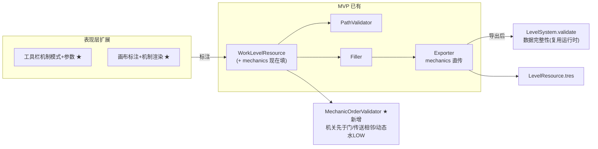

# 实施设计:monk 关卡设计工具增量——机制标注 + 顺序校验

> **任务来源**: 关卡设计工具 MVP(路径优先法最小闭环,main=93943ca,82 测试绿)完成后,用户选「工具增量」方向,具体做「机制标注 + 顺序校验」(工具差异化核心——手工 .tres 易错、运行时 validate 查不到路径顺序约束)。本 spec 是该增量的实施级设计。
> **任务内容**: 在 MVP 基础上增加路径上标注 5 种机制(门/机关/传送/桥/动态水)+ 路径顺序校验(机关先于门/桥、传送 A→B 相邻、动态水 LOW),让工具能设计含机制的关卡并保证按设计 path 可通关。
> **参考文档**:
> - `docs/project/2026-07-09-level-design-tool-design.md` — 设计级 spec(§8 机制标注+校验框架、§13 开放问题:工具 vs 运行时校验边界)
> - `docs/superpowers/specs/2026-07-12-level-design-tool-mvp-design.md` — MVP 实施 spec(前置,本增量其上)
> - `docs/project/2026-07-09-mechanics-spec-design.md` — 机制规范(§4.7 动态水相位、机关/门 OR 语义、传送成对)
> - `scripts/tool/`(WorkLevelResource/PathValidator/Filler/Exporter)+ `addons/level_designer/` — MVP 现状接入点
> **生成日期**: 2026-07-12

| 字段 | 值 |
|---|---|
| 日期 | 2026-07-12 |
| 状态 | 实施级 spec,待用户审 → writing-plans |
| 产物路径 | `docs/superpowers/specs/2026-07-12-level-tool-mechanics-design.md`(本文件) |
| 产出流程 | superpowers:brainstorming(交互方式 + 校验边界决策)→ 本文档 → writing-plans |
| 上游 | 设计级 spec §8、MVP spec、机制规范、MVP 代码 |
| 下游 | writing-plans 逐步实施计划 |

## 1. 范围

**纳入**:
- `MechanicOrderValidator`(路径顺序校验:机关先于门/桥、传送 A→B 相邻、动态水 LOW)
- 主视图/画布扩展:工具栏机制模式(无/机关/门/传送/桥/动态水)+ 参数输入 + 点击标注/清除 + 机制格渲染
- 导出前校验追加 `MechanicOrderValidator`

**不纳入(延后)**:
- `obstacle_overrides` 逐格微调 UI、undo、拖拽画路径、自动随机生成(各自另批次)
- 数据完整性校验(复用运行时 validate,不重复实现)

## 2. 关键决策与理由(避免长期遗忘)

| # | 决策 | 理由 | 弃选替代及其原因 |
|---|---|---|---|
| D1 | 标注交互 = 工具栏模式 + 点击标注 | 与 MVP 画路径的点击范式一致、直观;参数输入框清晰;再点同格清除简单 | 右键菜单:层级深、参数输入不如输入框;inspector 编辑:选格+定位字段繁琐 |
| D2 | 顺序校验独立新模块 `MechanicOrderValidator` | 路径顺序约束(机关先于门等)是运行时 `validate` 查不到的工具独特价值,需独立纯逻辑模块 GUT 可测 | 混入 `PathValidator`:职责混淆(路径结构 vs 机制顺序) |
| D3 | 数据完整性复用运行时 `LevelSystem.validate`(导出后对 lr 调一次) | DRY,不重复实现成对/lever 引用/period 校验;运行时 validate 已成熟 | 工具独立实现数据完整性:重复逻辑、维护双份、易漂移 |
| D4 | `Exporter` 不改(mechanics 直传) | MVP 已 mechanics 直传,本增量只填 `work.mechanics`,导出路径无需动 | 改 Exporter:无必要,违反外科手术式 |
| D5 | 5 种机制 + 3 类顺序校验,obstacle/undo 延后 | 聚焦机制标注核心价值;obstacle/undo 是编辑便利非机制,另批次更清晰 | 全做:范围过大、违背增量交付 |

## 3. 架构(MVP + 本增量)

## 4. MechanicOrderValidator 校验规则

`validate(path: Array[Vector2i], mechanics: Array[MechanicData]) -> Array[String]`:

- **机关先于门/桥**(OR 语义):对每个 `DoorData`/`BridgeData` d(path index = i),须**存在**其 `lever_ids` 中某机关格 path index < i(任一机关先踩即开启)。报错:"门/桥 X 未在机关 Y 之前经过"
- **传送 A→B 相邻**:每个 `pair_id` 的两格,在 path 中须**相邻**(A 紧接 B,传送步)。报错:"传送对 pair_id 须相邻"
- **动态水 LOW**:每个 `DynamicWaterData`(coord = path[i]),须满足 `i % period < (period + 1) / 2`(踏入前 path 长度 i 的 LOW 相位,机制规范 §4.7)。报错:"动态水须经低水位"
- **不查数据完整性**(lever 引用存在/period≥2/pair_id 成对)——由运行时 `LevelSystem.validate` 负责(D3)

> `i` = 踏入该格前的 path 长度 = 该格在 path 中的 0-indexed 下标。

## 5. 标注交互(表现层)

- **工具栏**:机制模式选项(无/机关/门/传送/桥/动态水)+ 参数输入(`pair_id` 文本 / `lever_ids` 文本逗号分隔 / `period` 数字;按所选机制类型显示相关输入)
- **机制模式下点击路径格**:`work.mechanics` 加对应 `MechanicData`(coord=格,填参数);再点同格(同类型)→ 清除该格机制
- **画布 `_draw`**:机制格按类型渲染(`COLOR_DOOR`/`COLOR_LEVER`/`COLOR_BRIDGE`/`COLOR_DWATER_LOW`/`COLOR_PORTAL`)+ 标号(pair_id 首字符 / lever id)
- **导出前**:`PathValidator` + `MechanicOrderValidator` 全 pass 才导出(否则 print 错误,不导出);导出后 `LevelSystem.validate(lr)` 报数据完整性错(若有)则警告

## 6. 数据流

选机制模式 + 参数 → 点路径格标注 → `work.mechanics` → 导出前 `PathValidator` + `MechanicOrderValidator` → `Exporter`(mechanics 直传) → `LevelResource.tres` → 游戏 `load`(运行时 validate 数据完整性 + `move` can_pass 实时顺序)

## 7. 任务切片(TDD,喂给 writing-plans)

| # | 模块 | 红测 → 绿 | 测试 |
|---|---|---|---|
| 1 | `mechanic_order_validator.gd` | 机关先于门 pass/fail、传送相邻 pass/fail、动态水 LOW pass/fail | GUT |
| 2 | 集成 | 标注含机制关卡 → 导出 → `LevelSystem.load` + 按设计 path move 通关 | GUT 集成 |
| 3 | `LevelCanvas`/`MainView` 标注交互 | 手动:选模式+参数→点格标注/清除→机制格渲染 | 手动 |
| 4 | 导出前加 `MechanicOrderValidator` | 手动:非法顺序不导出 + print 错误 | 手动 |

## 8. 验收

- [ ] 5 种机制可标注(参数正确填入 `MechanicData`)
- [ ] `MechanicOrderValidator` 3 类顺序校验 GUT 全覆盖
- [ ] 导出含机制 `LevelResource` 游戏可加载 + 按设计 path 通关
- [ ] 数据完整性复用运行时 `validate`(导出后),工具不重复实现
