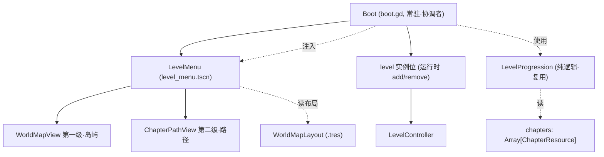
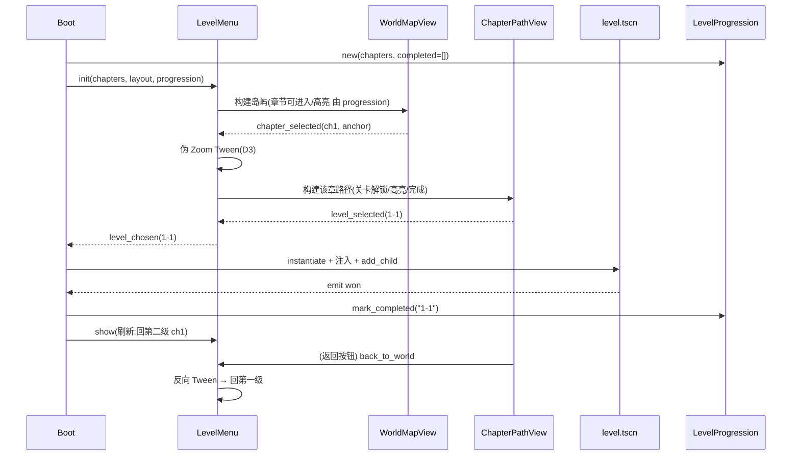

# 设计规范:monk 两级地图式选关菜单

> **任务来源**: 首批 8 关 + 选关入口已 merge main(d21d054)+ push,128 测试绿。现有选关入口是 `boot.gd` 代码构建的单级 VBox 列表(章节标题 + 关卡按钮),用户认为「不够完善」,要求重设计为两级菜单:第一级竖向滚动的「图案地图」(类超级马里奥惊奇世界选择),点击区域后动画切入第二级。经 brainstorm 多轮澄清(视觉伴侣辅助),形态/动画/数据/架构全部锁定。
> **任务内容**: 定义两级地图菜单(第一级分立世界岛屿 + 第二级关卡路径地图 + 伪 Zoom 过渡)的架构、独立布局数据 `WorldMapLayout`、解锁与返回流程、`boot.gd` 改造、首份布局坐标、测试与验收。**仅重构选关 UI 层;关卡逻辑、`LevelProgression` 解锁规则、关卡数据本身不动。**
> **参考文档**:
> - `docs/superpowers/specs/2026-07-12-first-levels-and-select-design.md` — 现有选关入口(boot 常驻 / ChapterResource / LevelProgression / 通关流转),本 spec 重构其 UI 层
> - `scripts/ui/boot.gd` — 现有选关表现层(被改造,保留测试依赖字段)
> - `scripts/level/level_progression.gd` — 解锁/高亮纯逻辑(复用,不改)
> - `scripts/level/chapter_resource.gd` / `level_meta.gd` — 章节与关卡元数据(不改,通过 id 关联)
> - `docs/project/2026-07-09-art-style-guide-design.md` — 美术风格(禅意水墨,占位美术参考)
> - 超级马里奥惊奇 世界选择/关卡地图(用户指定参考,外部)
> **生成日期**: 2026-07-14

| 字段 | 值 |
|---|---|
| 日期 | 2026-07-14 |
| 状态 | 设计已确认,待 spec 复核 |
| 产物路径 | 本文件 |
| 产出流程 | superpowers:brainstorming(视觉伴侣) →(用户确认)→ 写 spec →(复核)→ writing-plans → 实施 |
| 上游 | first-levels-and-select spec、boot.gd、level_progression.gd |

## 1. 背景与目标

现有选关入口(`boot.gd`)是单级 VBox:遍历 chapters × main_levels,每关一个 Button,通关 ✓ / 当前 ▶ / 未解锁 disabled。功能可用但**体验扁平**,不符合「寺院禅意 + 益智探索」的产品调性。

本 spec 把它重设计为**两级地图式菜单**(参考超级马里奥惊奇):

1. **第一级 · 世界地图**:竖向滚动的画布,每个章节是一块带主题的「岛屿」,岛屿按解锁顺序用虚线串起
2. **第二级 · 章节关卡路径**:进入某岛屿后,该章关卡以蜿蜒路径节点呈现,完成/当前/锁定状态可视
3. **过渡 · 伪 Zoom**:点击岛屿 → 镜头推进感的 Tween 切换到第二级

**目标**:

- 提升选关体验的探索感与主题代入感(不改玩法)
- 把菜单 UI 从 `boot.gd` 抽成**独立模块**(单一职责,`boot.gd` 回归顶层协调)
- 菜单**布局坐标数据独立**(逻辑/表现分离,改菜单不动关卡数据)
- 复用现有 `LevelProgression`,**不新增解锁规则**
- 保持 `boot` 常驻架构与现有测试契约(外科手术式,不破坏 `test_boot`)

**非目标**:求解器、存档、路径分叉、正式美术、菜单坐标可视化编辑工具(均后置,见 §12)。

## 2. 关键决策摘要

| # | 决策点 | 决策 | 理由 | 否决的替代 |
|---|---|---|---|---|
| D1 | 第一级形态 | **分立世界岛屿**:每章一块带主题岛屿,竖向滚动、虚线串连 | 竖向滚动 + 章节主题分立,最接近马里奥惊奇世界选择;岛屿可承载主题美术 | 连续山水卷轴(禅意但章节边界弱、主题难区分);章节卡片流(太接近列表,失「地图」感) |
| D2 | 第二级形态 | **关卡路径地图**:关卡为蜿蜒路径节点,完成点亮/当前高亮/锁定上锁 | 与第一级统一「地图」语言,代入感强;状态可视 | 关卡网格(信息密但失地图语言);竖向列表(最接近现有 VBox,但放弃地图观感)。**成本**:每关需坐标 + 路径绘制 |
| D3 | 第一级→第二级过渡 | **伪 Zoom(Tween)**:岛屿放大淡出 + 第二级从岛屿屏幕锚点浮现 | 用最小代价(组合 Tween + 锚点,约几十行)近似「钻进去」代入感,观感≈真共享 80% | 真·共享空间(世界与关卡同坐标系,数据最复杂,原型期不值);纯交叉淡入(最省但失代入感) |
| D4 | 布局坐标数据存放 | **独立 `WorldMapLayout` Resource** | 菜单布局是「表现」,关卡是「逻辑」,是不同功能模块(用户决策);独立后改菜单不动关卡数据,反之亦然 | 扩展 `LevelMeta`/`ChapterResource` 加坐标字段(虽与现有 `display_name`/`difficulty` 表现元数据风格一致,但把表现坐标耦合进逻辑数据,双关注点) |
| D5 | 路径拓扑 | **线性**:第一级按 `chapters` 顺序连岛屿,第二级按 `levels` 顺序连关卡;不存连接关系 | 契合现有 `LevelProgression` 线性解锁,YAGNI;连线由顺序推导,数据最简 | 存图结构/`edges` 字段(支持分叉,首批不需要) |
| D6 | 代码组织 | **菜单独立模块 + `boot` 协调**:新建 `scripts/ui/level_menu/` + `Scenes/level_menu.tscn`,`boot.gd` 瘦身为协调者 | 单一职责(文件膨胀即重构信号);视图可独立 GUT 测;与 D4 模块分离理念一致 | 单文件扩展 `boot.gd`(两级地图 + 动画全塞入,300+ 行巨型,违反原则) |
| D7 | 解锁逻辑 | **复用 `LevelProgression`**;章节可进入 = 该章首关 `id in progression.unlocked_ids()` | 零新解锁逻辑;跨章节解锁已被 `test_unlock_crosses_chapter_boundary` 覆盖 | 新写章节级解锁规则(重复造轮子,且与关卡解锁割裂) |
| D8 | 坐标编辑手段 | **手工 `.tres` 起步**(首份覆盖现有 2 章 8 关) | 8 关量小,手写坐标够用;原型期验证交互优先 | 扩展 `LevelDesigner` 工具做可视化排版(原型期 over-engineering,后补) |
| D9 | 美术 | **占位**:岛屿/关卡用 Panel + emoji Label,`theme_color`/`icon` 数据驱动 | 原型期先验证交互与布局;数据驱动便于日后替换 | 直接做正式水墨美术(交互未定先做美术,返工浪费) |

## 3. 架构:菜单独立模块 + boot 协调(D6)

`boot.tscn` 仍常驻(沿用 first-levels-and-select spec D1),但选关 UI 从「`boot.gd` 内联 VBox」改为独立的 `LevelMenu` 子系统。`boot.gd` 退化为顶层协调者:持有 `LevelMenu` + `level` 实例,负责二者切换与胜负。



**职责边界**:

- `LevelMenu`:加载 `WorldMapLayout`,构建两级视图,协调 Tween 过渡,对外只 emit `level_chosen(level)`。内部记「当前章节」,使关卡返回时回到对应第二级。
- `WorldMapView` / `ChapterPathView`:纯表现,构建节点 + 接点击,emit 语义信号(`chapter_selected` / `level_selected` / `back_to_world`)。解锁/高亮/完成状态由 `LevelMenu` 查 `LevelProgression` 后注入。
- `boot.gd`:实例化 `LevelMenu` 注入 `chapters`/`layout`/`progression`;监听 `level_chosen` → 实例化 `level.tscn`;`won` → `mark_completed` + 通知菜单刷新;`back` → 回菜单。

## 4. 数据结构(D4 / D5)

布局坐标集中到独立 Resource。三个**独立脚本文件**(Godot 嵌套 Resource 子类在 `Array[X]` 内 `@export` 支持有限,须独立 `class_name`,与 `LevelResource.tiles` 同理):

```gdscript
# scripts/level/world_map_layout.gd
class_name WorldMapLayout
extends Resource

@export var canvas_size: Vector2                     # 第一级世界画布尺寸(竖向滚动内容)
@export var chapters: Array[ChapterMapEntry] = []    # 第一级岛屿,按解锁顺序

# scripts/level/chapter_map_entry.gd
class_name ChapterMapEntry
extends Resource

@export var chapter_id: String          # → ChapterResource.id
@export var position: Vector2           # 岛屿在世界画布的位置
@export var theme_color: Color          # 岛屿主题色
@export var icon: String                # 图标(emoji 或资源路径)
@export var path_size: Vector2          # 第二级该章路径画布尺寸
@export var levels: Array[LevelMapEntry] = []   # 该章关卡坐标,按 main_levels 顺序

# scripts/level/level_map_entry.gd
class_name LevelMapEntry
extends Resource

@export var level_id: String            # → LevelMeta.id
@export var position: Vector2           # 关卡在该章路径画布上的位置
```

**关联方式 = id 引用**:`ChapterMapEntry.chapter_id` ↔ `ChapterResource.id`,`LevelMapEntry.level_id` ↔ `LevelMeta.id`。布局数据**不内联** `LevelResource`(避免双源真相,改菜单/关卡互不影响)。路径连线由数组顺序推导(D5 线性),不存连接关系。

`.tres` 落位:`resources/menu/world_map_layout.tres`(新建 `menu/` 子目录)。

## 5. 两级视图与交互(D1 / D2 / D7)

### 5.1 第一级 WorldMapView(分立岛屿,竖向滚动)

- `ScrollContainer` + 内容 `Control`(size = `canvas_size`),竖向滚动。
- 遍历 `layout.chapters`,每章一个岛屿节点:`Panel`(底色=`theme_color`)+ `Label`(icon)+ `Label`(display_name,查 `ChapterResource`)+ `Label`(进度如 `3/5`)。
- 岛屿间按 `chapters` 顺序用 `Control._draw` 画虚线连接(D5)。
- **章节可进入**(D7):该章首关 `id in progression.unlocked_ids()`。不可进入 → 岛屿半透明 + 🔒。
- **章节高亮**:含 `progression.highlighted_id()` 的章节加高亮环。
- 点击可进入岛屿 → emit `chapter_selected(chapter_id, island_screen_center)`(屏幕锚点供 D3 过渡用)。

### 5.2 第二级 ChapterPathView(关卡路径地图)

- `Control`(size = `path_size`),`_draw` 按 `levels` 顺序画虚线路径;完成的段实线、未完成虚线。
- 每关一个节点:`Panel`/圆形 + `Label`(编号)+ 状态标记。
- **关卡解锁/高亮/完成**:直查 `progression`(`id in unlocked_ids()` / `== highlighted_id()` / `is_completed`)。完成 → ✓ 点亮;当前 → ▶ 高亮环;锁定 → 灰 + 🔒。
- 点击已解锁关卡 → emit `level_selected(level)`。
- 「返回」按钮 → emit `back_to_world`。
- 单章 ≤5 关,原型期一屏放下,暂不滚动(关多再加,见 §12)。

### 5.3 解锁与返回流程



- **进关卡**:第二级点关卡 → `Menu` emit `level_chosen` → `Boot` 实例化 `level.tscn`(`Menu` 隐藏)。
- **通关**:`level` emit `won` → `Boot` 读 `level.meta.id` → `mark_completed` → 释放 level → `Menu.show()` 回到**当前章节第二级**(刷新解锁/✓)。不自动进下一关(沿用 first-levels-and-select D2)。
- **返回**:关卡内 HUD 返回 → `back_requested` → `Boot` 释放 level → `Menu.show()` 回当前章节第二级(不解锁)。
- **第二级→第一级**:返回按钮 → 反向 Tween。
- `LevelMenu` 内部状态机:`WORLD` / `CHAPTER`(当前 chapter_id)/ 隐于关卡后。

## 6. 伪 Zoom 过渡(D3)

`level_menu.gd` 持两个 view,用 `create_tween` 并行编排。**两视图独立,不共享坐标系**(故称「伪」)。

**进入第二级** `enter_chapter(chapter_id, anchor)`:

1. `ChapterPathView` 预构建该章路径;初始 `modulate.a = 0`、`scale = 0.3`、`position` 使其中心对齐 `anchor`(被点岛屿屏幕中心)。
2. 并行 Tween(~0.4s,`TRANS_QUAD` / `EASE_OUT`):
   - `WorldMapView.modulate.a`: 1 → 0.35(保留作半透背景)
   - 被点岛屿节点:`scale` 1 → 1.8、`modulate.a` → 0(单独强调「被钻入」)
   - `ChapterPathView`:`modulate.a` 0 → 1、`scale` 0.3 → 1、`position` → 屏幕中心
3. 完成:`ChapterPathView` 激活接输入;`WorldMapView` 暂停交互。

**返回第一级** `exit_to_world()`:反向 Tween;完成后 `WorldMapView` 复原 `modulate.a = 1`、清当前章节。

> Control 缩放围绕 pivot 的具体实现(`pivot_offset` 或 position+scale 组合)、被点岛屿的屏幕坐标换算,留 plan 细化;spec 只定运动意图与参数。

## 7. 组件改动清单

| 组件 | 改动 | 新增/改 |
|---|---|---|
| `scripts/level/world_map_layout.gd` | 新建:`WorldMapLayout`(canvas_size + chapters) | 新增 |
| `scripts/level/chapter_map_entry.gd` | 新建:`ChapterMapEntry` | 新增 |
| `scripts/level/level_map_entry.gd` | 新建:`LevelMapEntry` | 新增 |
| `scripts/ui/level_menu/level_menu.gd` | 新建:两级协调 + 伪 Zoom Tween + 状态机;emit `level_chosen` | 新增 |
| `scripts/ui/level_menu/world_map_view.gd` | 新建:第一级岛屿层(滚动/连线/点击);emit `chapter_selected` | 新增 |
| `scripts/ui/level_menu/chapter_path_view.gd` | 新建:第二级路径(连线/节点/返回);emit `level_selected`/`back_to_world` | 新增 |
| `Scenes/level_menu.tscn` | 新建:根挂 `level_menu.gd`,含两 view 子节点 | 新增 |
| `scripts/ui/boot.gd` | 改:去 VBox/`_select_container`/`_build_select_ui`;新增 `_level_menu` + `_build_menu()`(实例化 `LevelMenu` 注入数据);**保留** `_chapters`/`_progression`/`_level_instance`/`_exit_level`(`test_boot` 依赖) | 改 |
| `Scenes/boot.tscn` | 改:`boot.gd` 内 `_build_menu` 代码实例化 `LevelMenu`(场景结构基本不变,仅挂脚本) | 改(约定) |
| `resources/menu/world_map_layout.tres` | 新建:首份布局(2 章 8 关坐标,见 §8) | 新增 |
| `tests/ui/test_world_map_layout.gd` | 新建:`WorldMapLayout` 校验(§9) | 新增 |
| `tests/ui/test_boot.gd` | 改:现有 2 测试保留(layout 缺失降级使 `test_ready_safe` 仍过);按需补 `LevelMenu` 实例化 | 改 |

> `chapter_resource.gd` / `level_meta.gd` / `level_progression.gd` / `level.tscn` / `hud.gd` **均不改**。

## 8. 首份 WorldMapLayout 布局(D8,2 章 8 关)

手工 `.tres`,坐标为实现期建议值(可在 plan/实施微调)。第一级竖向画布、岛屿居中纵列;第二级每章蜿蜒路径。

**第一级**(canvas_size = `Vector2(720, 1280)`):

| chapter_id | position | theme_color | icon | 进度来源 |
|---|---|---|---|---|
| ch1 前院 | `(360, 320)` | `Color(0.42, 0.56, 0.35)` | 🏯 | `main_levels` 完成/总数 |
| ch2 后山 | `(360, 820)` | `Color(0.55, 0.42, 0.26)` | ⛰️ | 同上 |

**第二级 · 前院**(path_size = `Vector2(720, 960)`,5 关蜿蜒):

| level_id | position |
|---|---|
| 1-1 | `(140, 140)` |
| 1-2 | `(360, 260)` |
| 1-3 | `(560, 400)` |
| 1-4 | `(320, 580)` |
| 1-5 | `(180, 780)` |

**第二级 · 后山**(path_size = `Vector2(720, 760)`,3 关):

| level_id | position |
|---|---|
| 2-1 | `(160, 180)` |
| 2-2 | `(440, 360)` |
| 2-3 | `(300, 600)` |

> `level_id` 取各关实际 `LevelMeta.id`(`"1-1"`~`"2-3"` 格式;**文件名 `l1_1` 等 ≠ id**,见 §9 校验)。坐标单位为画布像素,实现期按岛屿节点尺寸与视口微调。

## 9. 测试与验证

**GUT 测试清单**:

- `test_world_map_layout.gd`(新):校验首份 layout——
  - 每个 `ChapterMapEntry.chapter_id` ↔ 已加载 `ChapterResource` 一一对应
  - 每个 `LevelMapEntry.level_id` ↔ 该章 `main_levels` 顺序一致、一一对应
  - 反向:每个已加载关卡在 layout 内有坐标(缺失 → 测试 fail,避免关卡「飘」在地图外)
- `test_level_progression.gd`(复用,不改):章节可进入 = 章首关 `in unlocked_ids()`,跨章解锁逻辑已被现有用例覆盖
- `test_boot.gd`(改):`test_ready_safe_without_chapter_files`——layout 缺失时 `Boot._ready` 安全降级(`_chapters==[]`、`_progression` 非空);`test_level_instance_cleaned_on_exit`——`_exit_level` 仍清 `_level_instance`

**逻辑/表现分离**(项目原则):`WorldMapLayout` 校验、解锁映射为纯逻辑 GUT 测;Tween/岛屿渲染为表现层,不测(人工 QA)。

**人工 QA**(用户执行):

- 启动 → 第一级世界岛屿地图(2 岛屿,竖向可滚),前院可进入高亮、后山锁定
- 点前院 → 伪 Zoom → 第二级前院路径(5 节点),1-1 解锁高亮、余锁定
- 点 1-1 → 进入关卡;通关 → 回第二级,1-1 ✓、1-2 解锁高亮
- 第二级返回 → 反向 Tween → 回第一级;关卡内返回 → 回当前章节第二级

## 10. 验收

- [ ] `boot` 启动即第一级世界岛屿地图;前院可进入且高亮、后山锁定;竖向可滚动
- [ ] 点前院岛屿 → 伪 Zoom 过渡 → 第二级前院路径;1-1 解锁高亮,1-2~1-5 锁定
- [ ] 点 1-1 → 加载关卡;通关回第二级,1-1 ✓、1-2 解锁高亮;关卡内返回 → 回当前章节第二级
- [ ] 第二级返回按钮 → 反向 Tween → 回第一级
- [ ] `WorldMapLayout` 缺失时 `boot` 安全降级(`test_ready_safe` 过)
- [ ] GUT:`test_world_map_layout` 校验通过;`test_boot` 适配通过;`test_level_progression` 不变绿;总数 = 128 + 新增(原 128 不退化)
- [ ] 占位美术(emoji/色块)章节与状态可辨识

## 11. 后续 / 开放问题

- **菜单坐标可视化编辑**:现 D8 手工 `.tres`;日后扩展 `LevelDesigner` 或专用工具拖拽排版岛屿/关卡坐标
- **正式美术**:替换 D9 占位为水墨岛屿/节点/路径美术(依美术风格指南)
- **路径分叉**:现 D5 线性;需分叉时加 `edges` 字段、`LevelProgression` 解锁规则同步
- **第二级滚动**:单章 >5 关一屏放不下时,第二级加 `ScrollContainer`
- **存档**:沿用 first-levels-and-select D5 后置(内存解锁)
